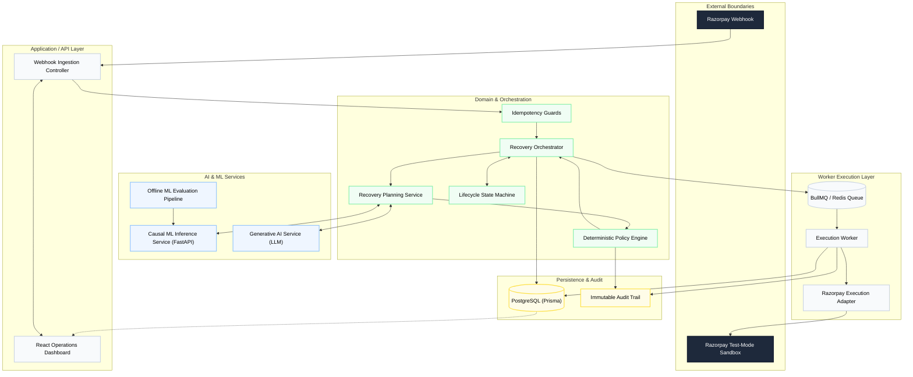

# Razorpay AI Revenue Recovery Architecture

An evaluation-first, causal-AI revenue recovery system designed with enterprise-grade deterministic financial safety.

## 1. System Overview

**What is this system?** 
This is a comprehensive, asynchronous revenue recovery architecture for processing failed payment events (e.g., card expiry, bank timeouts, insufficient funds). It ingest webhooks, utilizes AI to diagnose and plan interventions, strictly enforces financial safety rules via a deterministic policy engine, and executes recovery actions through resilient queue workers.

**What problem does it solve?** 
Merchants lose significant revenue when recurring payments fail. Blindly retrying cards wastes API calls, triggers fraud alerts, and annoys customers. Doing nothing loses the customer. 

**Why does it exist?** 
To maximize recovered revenue by personalizing the recovery intervention (e.g., silent API retry vs. SMS payment link) based on the specific context of the failure, while guaranteeing that AI hallucinations or ML errors can never trigger unsafe financial operations.

---

## 2. Global Architecture Diagram



*(or in text format below)*

### Global Architecture (Text View)
- **External Boundaries:** Razorpay Webhook -> Razorpay Test-Mode Sandbox
- **API Layer:** Webhook Ingestion Controller, React Operations Dashboard
- **Domain Layer:** Recovery Orchestrator, Idempotency Guards, Recovery Planning Service, Deterministic Policy Engine, Lifecycle State Machine
- **AI & ML Services:** Causal ML Inference Service (FastAPI), Generative AI Service (LLM), Offline ML Evaluation Pipeline
- **Worker Execution Layer:** BullMQ / Redis Queue, Execution Worker, Razorpay Execution Adapter
- **Persistence & Audit:** PostgreSQL (Prisma), Immutable Audit Trail

---

## 3. End-to-End Execution Flow

1. **Webhook Arrival:** A payment failure event enters the system.
2. **Idempotency Guard:** The system checks database unique constraints to drop duplicates.
3. **State Machine:** The case transitions to `DETECTED`.
4. **AI Planning:** The LLM diagnoses the failure reason and drafts SMS copy. The ML pipeline provides Causal Propensity Scores (Net Expected Incremental Value).
5. **Deterministic Policy:** The policy engine intercepts the AI plan. It enforces consent, cooldowns, and maximum retry attempts. 
6. **Approval/Rejection:** If approved, the case transitions to `PLANNED`. If rejected, it moves to `STOPPED` or `ESCALATED`.
7. **Queuing:** The approved intervention is dispatched to BullMQ.
8. **Execution:** The worker pulls the job, delegates to the Razorpay adapter, and executes the bounded action (e.g., sending a payment link).
9. **Outcome:** The result is persisted, logging to the immutable audit trail, transitioning the state to `RECOVERED` or `FAILED`.

---

## 4. Feature Inventory

### Core Platform
- **Webhook Ingestion:** Express/NestJS endpoints parsing JSON payloads.
- **Event Processing & Case Creation:** Mapping raw payloads to typed `RecoveryCase` entities.
- **State Machine:** Enforces strict lifecycle transitions (`DETECTED` → `PLANNED` → `RECOVERED` / `FAILED` / `STOPPED` / `ESCALATED`).
- **Terminal States:** Prevents execution on cases that have already resolved.

### Financial Safety Controls
- **Idempotency:** Strict PostgreSQL `UNIQUE` constraints prevent duplicate webhook processing.
- **Optimistic Concurrency Control (OCC):** Row-versioning ensures stale cases cannot be updated or executed.
- **Distributed Locking:** Workers execute via atomic BullMQ jobs.
- **Maximum-Attempt Enforcement:** Policy engine blocks interventions if `attemptCount` exceeds thresholds.
- **Consent Enforcement:** Blocks SMS/Email plans if customer opted out.
- **Failure Isolation:** AI or execution failures do not crash the ingestion layer; bounded contexts handle degradation.

### Causal Machine Learning (AI)
- **Architecture:** Multi-Treatment T-Learner (XGBoost).
- **Treatments:** Control, T1 (Retry), T2 (Payment Link).
- **Uplift Estimation (CATE):** Estimates $\hat{\tau}_t(x) = \hat{\mu}_t(x) - \hat{\mu}_0(x)$.
- **Net Expected Incremental Value (Net EIV):** Subtracts intervention costs (e.g., API vs SMS cost) to optimize for profitability.
- **Inference API:** Python FastAPI service answering to the NestJS domain.
- **Fallback Behavior:** Gracefully falls back to mock heuristic scores if the ML service is down.
- **Evaluation Pipeline:** Offline script calculating AUROC, PR-AUC, Brier scores, Bootstrap CIs, and policy simulation.
- **Provenance:** Trained on the Hillstrom public RCT dataset to validate causal methodology mathematically.

### Generative AI (LLM)
- **Failure Diagnosis:** Reads Razorpay decline codes (e.g., `insufficient_funds`) and maps to human-readable root causes.
- **Customer Communication:** Drafts empathetic, context-aware SMS/Email reminders.
- **Structured Output:** Strictly enforced via Zod schema validation.
- **Fallback Templates:** Hardcoded deterministic text templates take over instantly if the LLM provider times out.

### Execution Engine
- **Asynchronous Workers:** BullMQ manages background jobs with automatic retries for transient network errors.
- **Provider Abstraction:** Code executes via a strictly bounded `ExecutionProvider` interface.
- **Razorpay Adapter:** Executes simulated test-mode recovery actions against the Razorpay API.
- **Outcome Logging:** Appends execution results directly to the case's audit history.

### Dashboard UI (React)
- **Data Mode Transparency:** Explicitly labels data as `RAZORPAY_TEST` and AI scores as `Offline Benchmark Model`.
- **Funnels & Metrics:** Visualizes Total At Risk, System Recovered, False Intervention Rate, and Active Escalations.
- **Case Pipeline:** Table view with rich filtering by case state.
- **Audit Trail:** Clicking a case reveals its entire lifecycle: webhook payload, ML Propensity Scores, LLM Diagnosis, Policy Gate Decisions (Approved/Rejected), and Worker Execution Results.

---

## 5. Directory Structure & Services

The system is managed as a pnpm monorepo.

```text
├── apps/
│   ├── api/          # NestJS backend (Ingestion, Webhooks, API)
│   ├── evaluator/    # CLI batch evaluation runner
│   ├── frontend/     # React Operations Dashboard
│   ├── ml-pipeline/  # Python FastAPI XGBoost Microservice
│   └── worker/       # NestJS/BullMQ job executor
├── libs/
│   ├── contracts/    # Shared DTOs, interfaces, and enums
│   ├── domain/       # Core state machine, policy engine, planning
│   ├── evaluation/   # Financial metrics calculation engine
│   ├── llm/          # LLM client abstraction and fallbacks
│   └── persistence/  # Prisma schema, DB migrations, adapters
├── docs/             # Architecture, decisions, and documentation
├── infra/            # Docker compose and deployment configurations
└── tests/            # Integration and E2E testing suites
```

---

## 6. Developer Guide

### Installation
1. **Prerequisites:** Node.js 22 LTS, pnpm, Docker, Python 3.10+.
2. **Clone the repository.**
3. **Environment setup:** Copy `.env.example` to `.env` and fill in necessary keys.
4. **Install Node dependencies:** `pnpm install`
5. **Install Python dependencies:** `cd apps/ml-pipeline && pip install -r requirements.txt`

### Infrastructure & Database
1. **Start Services (Postgres, Redis):** `docker compose -f infra/compose/compose.yaml up -d`
2. **Run Migrations:** `pnpm --filter @rr/persistence prisma migrate deploy`
3. **Generate Prisma Client:** `pnpm --filter @rr/persistence prisma generate`

### Running the System
Run these in separate terminals to start the entire distributed system:
1. **API Server:** `pnpm --filter @rr/api dev`
2. **Worker Node:** `pnpm --filter @rr/worker dev`
3. **ML Service:** `cd apps/ml-pipeline/src && python main.py`
4. **Dashboard UI:** `pnpm --filter @rr/frontend dev` (Opens on `http://localhost:5173`)

### Testing & Evaluation
- **Integration Tests:** `pnpm test:integration` (Verifies state machine and idempotency against DB).
- **Linting:** `pnpm lint` (Runs oxlint across the monorepo).
- **Offline Batch Evaluation:** `pnpm evaluate-smoke` (Runs the Node.js batch evaluator).
- **ML Statistical Audit:** `cd apps/ml-pipeline/src && python statistical_audit.py` (Outputs the forensic causal AI audit report).

---

## 7. Documentation Index

The following critical technical documents detail specific subsystems:

| Document | Description |
|---|---|

| **[Architecture & Systems Design](docs/architecture/)** | Detailed diagrams and sequence flows of the ingestion and execution pipelines. |
| **[Architectural Decision Records (ADRs)](docs/decisions/)** | Immutable records of why specific technologies (NestJS, XGBoost, Prisma) were chosen. |
| **[Security & Resilience Model](SECURITY.md)** | How the system handles duplicate webhooks, stale states, LLM hallucinations, and API timeouts. |
| **[Failure Mode Recovery](docs/failures/FAILURES.md)** | Documentation on degradation fallbacks. |
| **[Evaluation Methodology](docs/evaluation/EVALUATION.md)** | How policy value is calculated and simulated offline. |

