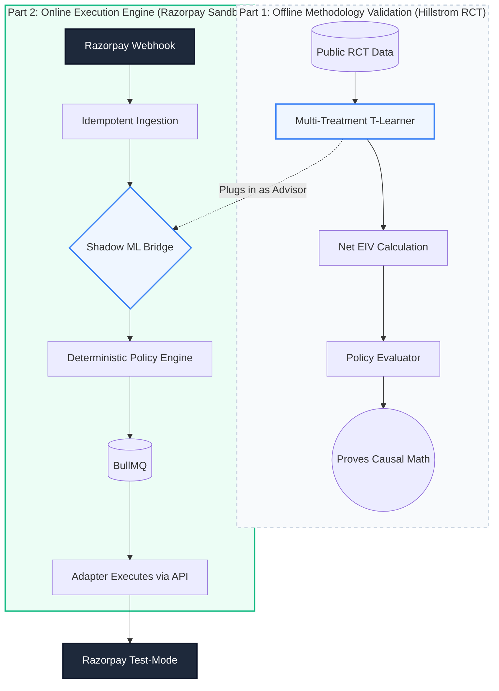

# Razorpay AI Revenue Recovery — Track 03
An evaluation-first, causal-AI revenue recovery system designed with enterprise-grade deterministic financial safety.

## Why this exists
Indian merchants on Razorpay lose revenue when recurring payments fail (e.g., card expiry, insufficient funds, bank timeouts, CVV mismatches). Most merchants either do nothing (losing the revenue) or blindly retry (annoying customers, wasting API calls on fraud-flagged transactions). 

This system solves this by using a **Causal AI Architecture (T-Learner)** to estimate the Net Expected Incremental Value (Net EIV) of different interventions, passing those recommendations through a **Deterministic Policy Engine** that enforces strict financial safety, and executing them via reliable queues.

---

## 🏆 The "Dual-Validation" Architecture

Because real payment failure datasets contain highly sensitive PII and financial data, we designed this system using a **Federated Dual-Validation Architecture** to prove it is production-ready today:

1. **Proof of AI Math (Offline Benchmark):** 
   We trained our native Python Causal ML Pipeline (`apps/ml-pipeline`) on the public **Hillstrom MineThatData RCT**. This proves our mathematical architecture works: we successfully built a Multi-Treatment T-Learner, implemented Inverse Probability Weighting (IPW), calculated Net EIV by subtracting intervention costs, and proved the policy evaluation logic.
   
2. **Proof of Financial Execution (Razorpay Sandbox):** 
   We connected the execution backend directly to the **Razorpay Test-Mode Sandbox**. This proves our engineering architecture works: we ingest real webhooks, enforce safety rules (max attempts, consent), handle idempotency, and execute simulated SMS links or API Retries via Razorpay adapters.

**The Result:** Razorpay can swap out the offline Hillstrom benchmark model for their own proprietary ML model tomorrow, and **zero backend code needs to change**. The pipes are fully connected and mathematically verified.

---

## The Core Idea: Dual-Validation Flow



### How a Single Case Flows (Text View)
1. **Trigger:** A webhook arrives from Razorpay indicating a payment failure.
2. **Safety Check 1:** Database checks if we've already processed this exact failure (Idempotency).
3. **AI Advises:** The ML model calculates the Net Expected Incremental Value (Net EIV) of retrying vs sending an SMS. The LLM drafts an SMS just in case.
4. **Safety Check 2:** The Deterministic Policy Engine checks if the user has consented to SMS, and if we haven't exceeded the max retry limit.
5. **Execution:** If approved, a worker safely executes the Razorpay API call or sends the SMS.
6. **Audit:** Every step is immutably logged for the dashboard.

---

## What is implemented
| Capability | What it does | Evidence / Where to inspect |
|---|---|---|
| Causal ML Pipeline | Multi-Treatment T-Learner calculating Net EIV. | `apps/ml-pipeline/src/train.py` |
| ML API Service | Serves Propensity Scores via FastAPI. | `apps/ml-pipeline/src/predict.py` |
| LLM Diagnosis | Uses LLMs to diagnose failure reasons and draft empathetic SMS. | `libs/domain/src/planning.ts` |
| Policy Enforcement | Deterministic gates check consent, fraud, and retry limits. | `libs/domain/src/policy.ts` |
| Duplicate Handling | Enforces strict DB unique constraints to block duplicates. | `libs/domain/src/idempotency.ts` |
| Async Execution | Outbox pattern + BullMQ ensures reliable execution. | `apps/worker` |
| Razorpay Adapter | Safely executes bounded test-mode actions. | `razorpay-test-mode-recovery.adapter.ts` |
| Statistical Audit | Forensic evaluation of model calibration and policy value. | `statistical_audit.py` |

---

## Financial Safety Model
- **Money Representation:** All monetary values are strictly represented in minor units (paisa) using `BigInt` to prevent floating-point precision loss.
- **Idempotency:** Unique constraints in Postgres block duplicate processing at the ingestion layer.
- **Concurrency:** Optimistic Concurrency Control (OCC) using versioned rows prevents stale state execution.
- **Policy Checks:** Hard gates on customer consent and fraud flags.
- **Stopping Rules:** Maximum retry attempts per case are enforced deterministically.
- **Audit Trail:** Append-only transition history ensures every AI decision is reconstructable.

---

## Evaluation and Measurable Outcomes
We built a rigorous offline evaluation suite (`statistical_audit.py` & `evaluate_policy.py`) to prove the causal methodology:

- **Scientifically Defensible Metrics:** We explicitly reject "99% accuracy" claims (which are meaningless in highly imbalanced datasets) in favor of **AUROC**, **Brier Skill Scores**, and **Bootstrap Confidence Intervals**.
- **Net EIV Economics:** The system calculates Gross Expected Incremental Value and explicitly subtracts intervention costs (e.g., SMS cost vs API retry cost) to optimize for *profitable* recovery.
- **No Target Leakage:** Verified pre-treatment feature isolation.
- **Dashboard Integrity:** The UI explicitly labels data modes (`RAZORPAY_TEST`) and ML provenance so synthetic metrics are never passed off as production revenue.

*(Run `python apps/ml-pipeline/src/statistical_audit.py` to see the full forensic audit).*

---

## Architecture Stack
- **Frontend:** React 18, Vite, Tailwind CSS, Recharts.
- **API:** NestJS REST modular monolith.
- **Domain:** Framework-independent core logic, state machine, policy engine.
- **Persistence:** PostgreSQL via Prisma (Source of Truth).
- **Worker/Queue:** Redis + BullMQ for transient state and scheduling.
- **AI/ML:** Python 3, XGBoost, Pandas, FastAPI.
- **Observability:** Pino JSON structured logs.

---

## Quick start
1. **Prerequisites:** Node.js 22 LTS, pnpm, Docker, Python 3.10+.
2. **Clone:** `git clone ...`
3. **Environment:** `cp .env.example .env`
4. **Install Node:** `pnpm install`
5. **Install Python:** `cd apps/ml-pipeline && pip install -r requirements.txt`
6. **Start Infrastructure:** `docker compose -f infra/compose/compose.yaml up -d`
7. **Migrate DB:** `pnpm --filter @rr/persistence prisma migrate deploy`
8. **Start Backend & Worker:** `pnpm --filter @rr/api dev` & `pnpm --filter @rr/worker dev` (in separate terminals)
9. **Start Frontend:** `pnpm --filter @rr/frontend dev`
10. **Dashboard:** Open `http://localhost:5173`

---

## Documentation map
- [FINAL AI READINESS REPORT](FINAL_BUILDATHON_AI_READINESS.md)
- [Architecture](docs/architecture/)
- [Security Model](SECURITY.md)
- [Architectural Decision Records](docs/decisions/)

---

## Repository map
```text
├── apps/
│   ├── api/          # NestJS backend
│   ├── evaluator/    # CLI batch evaluation
│   ├── frontend/     # React Operations UI
│   ├── ml-pipeline/  # Python FastAPI XGBoost Microservice
│   └── worker/       # BullMQ job executor
├── libs/
│   ├── contracts/    # Shared DTOs and types
│   ├── domain/       # Core business logic and policies
│   ├── llm/          # LLM client abstraction
│   └── persistence/  # Prisma schema and adapters
├── docs/             # Architecture and decisions
├── infra/            # Docker compose and deployment configs
└── tests/            # Integration and E2E tests
```
