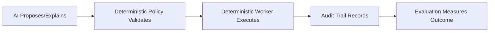
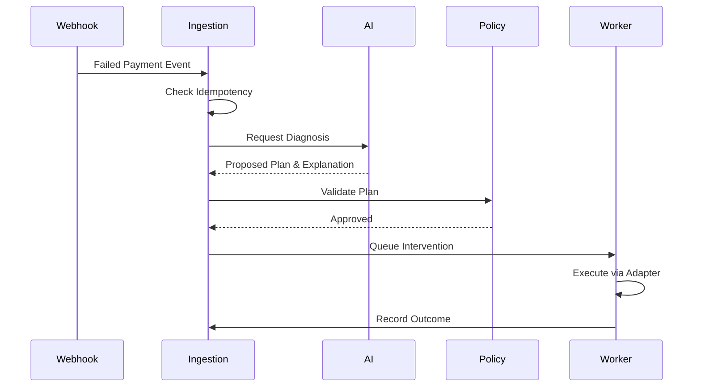

# Razorpay AI Revenue Recovery
An evaluation-first, bounded-AI revenue recovery system for payment failures.

## Why this exists
Indian merchants on Razorpay lose revenue when recurring payments fail (e.g., card expiry, insufficient funds, bank timeouts, CVV mismatches). Most merchants either do nothing (losing the revenue) or blindly retry (annoying customers, wasting API calls on fraud-flagged transactions). 

This system detects failed payments, diagnoses the root cause using an LLM, selects an appropriate bounded recovery intervention, and safely executes the recovery workflow, logging every outcome.

## The core idea


**Why AI is intentionally NOT used for certain tasks:**
AI is strictly an advisor for root-cause analysis and message drafting. It is intentionally **excluded** from policy enforcement, retry limits, idempotency checks, state transitions, direct money movement, and bypassing consent/fraud controls. These tasks are strictly handled by deterministic code.

## What is implemented
| Capability | What it does | Evidence / Where to inspect |
|---|---|---|
| Event Ingestion | Accepts webhook payloads, validating and creating revenue cases. | `apps/api/src/modules/ingestion` |
| Duplicate Handling | Enforces strict database-level unique constraints to drop duplicates. | `libs/domain/src/idempotency.ts` |
| Diagnosis & Planning | Uses LLM to diagnose failure reasons and draft interventions. | `libs/domain/src/planning.ts` |
| Policy Enforcement | Deterministic gates check consent, fraud, and retry limits. | `libs/domain/src/policy.ts` |
| Async Execution | Outbox pattern + BullMQ ensures reliable execution. | `apps/worker` |
| Adapter Integration | Simulated/Test Mode adapters for Razorpay, Twilio, and Resend. | `libs/persistence/src/repositories/contracts/` |
| Auditability | Immutable append-only event logs for all state transitions. | `libs/domain/src/state-machine.ts` |
| Evaluation | Reproducible synthetic batch evaluation vs baselines. | `libs/evaluation` |
| Dashboard | React/Vite UI showing cases, outcomes, and charts. | `apps/frontend` |

## End-to-end flow


## Architecture
- **Frontend:** React 18, Vite, Tailwind CSS, Recharts for dashboard UI with high-performance cursor pagination and multi-tenant merchant filtering.
- **API:** NestJS REST modular monolith.
- **Domain:** Framework-independent core logic, state machine, policy engine.
- **Persistence:** PostgreSQL via Prisma (Source of Truth), Outbox table.
- **Worker/Queue:** Redis + BullMQ for transient state and scheduling.
- **Event Relay:** PostgreSQL `LISTEN/NOTIFY` outbox publisher for zero-latency, low-CPU message propagation.
- **AI Layer:** Abstracted `llm-client` connecting to external LLMs, and a Shadow ML Propensity Pipeline (XGBoost logic simulator) that evaluates risk without overriding determinism.
- **Evaluation Runner:** CLI batch evaluator tool for synthetic datasets.
- **Observability:** Pino JSON structured logs.

## AI design and AI restraint
- **Task:** AI analyzes payment failure reasons and drafts empathetic customer communication (SMS/Email templates).
- **Justification:** LLMs are excellent at unstructured text analysis and generating polite, context-aware messages based on decline codes.
- **Fallback:** If the LLM provider times out or fails, the system automatically falls back to deterministic hardcoded templates.
- **Restraint:** The LLM output is heavily validated. It cannot execute actions; it only outputs structured `Decision` objects that the deterministic policy engine then reviews.
- **Scope:** Includes a Shadow ML pipeline (simulated XGBoost) to score `P(Recovery)` offline for future architectural transitions.

## Financial safety model
- **Money Representation:** All monetary values are strictly represented in minor units (paisa) using `BigInt` to prevent floating-point precision loss.
- **Idempotency:** Unique constraints in Postgres block duplicate processing.
- **Concurrency:** Optimistic Concurrency Control (OCC) using versioned rows prevents stale state execution.
- **Policy Checks:** Hard gates on customer consent and fraud flags.
- **Stopping Rules:** Maximum retry attempts per case are enforced deterministically.
- **Timeouts:** External adapter timeouts are mapped to `PROVIDER_TIMEOUT` and safely retried via exponential backoff.
- **Audit Trail:** Append-only transition history.

## Evaluation and measurable outcomes
- **Dataset:** 300 held-out synthetic cases (seeded PRNG) representing realistic failure distributions (insufficient funds, bank timeout, card expired, etc.).
- **Baseline 0:** No Action.
- **Baseline 1:** Naive Retry on first allowed channel.
- **Batch Evaluation:** A single command processes the dataset entirely deterministically, without live network calls.
- **Metrics Computed:** Total At Risk, System Recovered, Baseline Recovered, Incremental Recovery, False Interventions, Escalation Rate.

Example output from the deterministic synthetic evaluation dataset; rerun locally to reproduce using `pnpm evaluate-smoke`.

## Failure scenarios tested
| Scenario | Containment & Outcome | Evidence |
|---|---|---|
| Duplicate Webhooks | Rejected with 409 Conflict via DB unique constraint | `tests/integration/recovery_flow.test.ts` |
| Stale State | Rejected via OCC version mismatch | `tests/integration/resilience_flow.test.ts` |
| Provider Timeout | Caught, mapped to retryable error, backed off | `razorpay.adapter.ts` |
| Worker Crash | BullMQ automatically re-queues abandoned jobs | `apps/worker` |
| LLM Failure | Immediate fallback to deterministic templates | `libs/llm/src/fallbacks/` |
| Policy Blocked | Plan transition rejected, case escalated | `policy.test.ts` |
| Retry Exhaustion | Case forcibly stopped upon hitting max attempts | `tests/integration/resilience_flow.test.ts` |

## Dashboard / reviewer walkthrough
- **Operations Dashboard:** Shows the pipeline of revenue cases (`DETECTED` -> `PLANNED` -> `RECOVERED`).
- **Audit View:** Clicking a case reveals the AI reasoning, policy approval gates, and execution history.
- **Evaluation Dashboard:** Visualizes the `totalAtRisk` vs `systemRecovered` financial impact via Recharts.

## Quick start
1. **Prerequisites:** Node.js 22 LTS, pnpm, Docker.
2. **Clone:** `git clone ...`
3. **Environment:** `cp .env.example .env`
4. **Install:** `pnpm install`
5. **Start Infrastructure:** `docker compose -f infra/compose/compose.yaml up -d`
6. **Migrate DB:** `pnpm --filter @rr/persistence prisma migrate deploy`
7. **Start Backend & Worker:** `pnpm --filter @rr/api dev` & `pnpm --filter @rr/worker dev` (in separate terminals)
8. **Start Frontend:** `pnpm --filter @rr/frontend dev`
9. **Dashboard:** Open `http://localhost:5173`

## Commands
| Command | Purpose |
|---|---|
| `pnpm install` | Install workspace dependencies |
| `pnpm dev` | Start all apps |
| `docker compose -f infra/compose/compose.yaml up -d` | Start Redis and Postgres |
| `pnpm lint` | Run oxlint/eslint |
| `pnpm test:integration` | Run integration tests (needs DB) |
| `pnpm evaluate-smoke` | Run the batch evaluator on synthetic data |
| `pnpm build` | Build production bundles |

## Razorpay test-mode integration
The system operates in a simulated local mode by default for reproducibility. 
An optional, live Razorpay Test Mode adapter is included.
- **Requirement:** Set `ENABLE_RAZORPAY_TEST_MODE=true` and provide sandbox keys in `.env`.
- **Constraint:** This is strictly for test mode. It moves no real money and is not intended for production usage.

## Documentation map
- [Architecture](docs/architecture/)
- [Evaluation Methodology](docs/evaluation/EVALUATION.md)
- [Security Model](SECURITY.md)
- [Failure & Resilience](docs/failures/FAILURES.md)
- [Architectural Decision Records](docs/decisions/)
- [Implementation Completeness Audit](docs/project-status/IMPLEMENTATION-COMPLETENESS-AUDIT.md)

## Quality gates
- **Linting:** Enforced via `oxlint`.
- **Tests:** Unit and Integration tests running via Vitest.
- **CI/CD:** GitHub Actions workflows (`.github/workflows/`) for builds, tests, evaluation, and security checks.


## Future evolution
- Calibrated recovery-propensity model (XGBoost) trained on consented historical recovery outcomes.
- Streaming ingestion (Kafka) at production scale.
- Richer provider integrations (WhatsApp business API).
- Production authentication, RBAC, and multi-region HA deployment.

## Repository map
```text
├── apps/
│   ├── api/          # NestJS backend
│   ├── evaluator/    # CLI batch evaluation
│   ├── frontend/     # React Operations UI
│   └── worker/       # BullMQ job executor
├── libs/
│   ├── contracts/    # Shared DTOs and types
│   ├── domain/       # Core business logic and policies
│   ├── evaluation/   # Metrics calculation engine
│   ├── llm/          # LLM client abstraction
│   └── persistence/  # Prisma schema and adapters
├── data/
│   └── evaluation/   # Synthetic evaluation datasets
├── docs/             # Architecture, decisions, and evaluations
├── infra/            # Docker compose and deployment configs
└── tests/            # Integration and E2E tests
```

## Demo
Demo video: to be added before submission.
