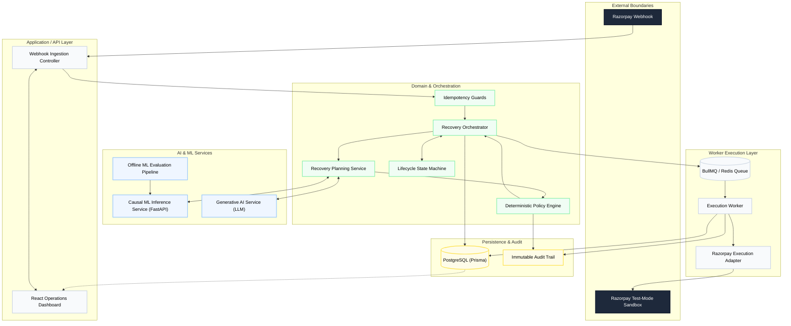

# Razorpay AI Revenue Recovery Architecture

An evaluation-first, causal-AI revenue recovery system designed with enterprise-grade deterministic financial safety.

## 1. System Overview

**What is this system?** 
This is a comprehensive, asynchronous revenue recovery architecture for processing failed payment events (e.g., card expiry, bank timeouts, insufficient funds). It ingest webhooks, utilizes AI to diagnose and plan interventions, strictly enforces financial safety rules via a deterministic policy engine, and executes recovery actions through resilient queue workers.

**What problem does it solve?** 
Merchants lose significant revenue when recurring payments fail. Blindly retrying cards wastes API calls, triggers fraud alerts, and annoys customers. Doing nothing loses the customer. 

**Why does it exist?** 
To maximize recovered revenue by personalizing the recovery intervention (e.g., silent API retry vs. SMS payment link) based on the specific context of the failure, while guaranteeing that AI hallucinations or ML errors can never trigger unsafe financial operations.

---

## 2. Global Architecture Diagram



*(or in text format below)*

### Global Architecture (Text View)
- **External Boundaries:** Razorpay Webhook -> Razorpay Test-Mode Sandbox
- **API Layer:** Webhook Ingestion Controller, React Operations Dashboard
- **Domain Layer:** Recovery Orchestrator, Idempotency Guards, Recovery Planning Service, Deterministic Policy Engine, Lifecycle State Machine
- **AI & ML Services:** Causal ML Inference Service (FastAPI), Generative AI Service (LLM), Offline ML Evaluation Pipeline
- **Worker Execution Layer:** BullMQ / Redis Queue, Execution Worker, Razorpay Execution Adapter
- **Persistence & Audit:** PostgreSQL (Prisma), Immutable Audit Trail

---

## 3. End-to-End Execution Flow

1. **Webhook Arrival:** A payment failure event enters the system.
2. **Idempotency Guard:** The system checks database unique constraints to drop duplicates.
3. **State Machine:** The case transitions to `DETECTED`.
4. **AI Planning:** The LLM diagnoses the failure reason and drafts SMS copy. The ML pipeline provides Causal Propensity Scores (Net Expected Incremental Value).
5. **Deterministic Policy:** The policy engine intercepts the AI plan. It enforces consent, cooldowns, and maximum retry attempts. 
6. **Approval/Rejection:** If approved, the case transitions to `PLANNED`. If rejected, it moves to `STOPPED` or `ESCALATED`.
7. **Queuing:** The approved intervention is dispatched to BullMQ.
8. **Execution:** The worker pulls the job, delegates to the Razorpay adapter, and executes the bounded action (e.g., sending a payment link).
9. **Outcome:** The result is persisted, logging to the immutable audit trail, transitioning the state to `RECOVERED` or `FAILED`.

---

## 4. Feature Inventory

### Core Platform
- **Webhook Ingestion:** Express/NestJS endpoints parsing JSON payloads.
- **Event Processing & Case Creation:** Mapping raw payloads to typed `RecoveryCase` entities.
- **State Machine:** Enforces strict lifecycle transitions (`DETECTED` → `PLANNED` → `RECOVERED` / `FAILED` / `STOPPED` / `ESCALATED`).
- **Terminal States:** Prevents execution on cases that have already resolved.

### Financial Safety Controls
- **Idempotency:** Strict PostgreSQL `UNIQUE` constraints prevent duplicate webhook processing.
- **Optimistic Concurrency Control (OCC):** Row-versioning ensures stale cases cannot be updated or executed.
- **Distributed Locking:** Workers execute via atomic BullMQ jobs.
- **Maximum-Attempt Enforcement:** Policy engine blocks interventions if `attemptCount` exceeds thresholds.
- **Consent Enforcement:** Blocks SMS/Email plans if customer opted out.
- **Failure Isolation:** AI or execution failures do not crash the ingestion layer; bounded contexts handle degradation.

### Causal Machine Learning (AI)
- **Architecture:** Multi-Treatment T-Learner (XGBoost).
- **Treatments:** Control, T1 (Retry), T2 (Payment Link).
- **Uplift Estimation (CATE):** Estimates $\hat{\tau}_t(x) = \hat{\mu}_t(x) - \hat{\mu}_0(x)$.
- **Net Expected Incremental Value (Net EIV):** Subtracts intervention costs (e.g., API vs SMS cost) to optimize for profitability.
- **Inference API:** Python FastAPI service answering to the NestJS domain.
- **Fallback Behavior:** Gracefully falls back to mock heuristic scores if the ML service is down.
- **Evaluation Pipeline:** Offline script calculating AUROC, PR-AUC, Brier scores, Bootstrap CIs, and policy simulation.
- **Provenance:** Trained on the Hillstrom public RCT dataset to validate causal methodology mathematically.

### Generative AI (LLM)
- **Failure Diagnosis:** Reads Razorpay decline codes (e.g., `insufficient_funds`) and maps to human-readable root causes.
- **Customer Communication:** Drafts empathetic, context-aware SMS/Email reminders in English (`EN_IN`) and Hinglish (`HI_IN`) — natural Hindi-English code-mixed text for urban Indian customers.
- **Structured Output:** Strictly enforced via Zod schema validation.
- **Fallback Templates:** Deterministic locale-aware templates (English + Hinglish) activate instantly if the LLM times out or returns malformed output.

### Execution Engine
- **Asynchronous Workers:** BullMQ manages background jobs with automatic retries for transient network errors.
- **Provider Abstraction:** Code executes via a strictly bounded `ExecutionProvider` interface.
- **Razorpay Adapter:** Executes simulated test-mode recovery actions against the Razorpay API.
- **Outcome Logging:** Appends execution results directly to the case's audit history.

### Dashboard UI (React)
- **Data Mode Transparency:** Explicitly labels data as `RAZORPAY_TEST` and AI scores as `Offline Benchmark Model`.
- **Funnels & Metrics:** Visualizes Total At Risk, System Recovered, False Intervention Rate, and Active Escalations.
- **Case Pipeline:** Table view with rich filtering by case state.
- **Audit Trail:** Clicking a case reveals its entire lifecycle: webhook payload, ML Propensity Scores, LLM Diagnosis, Policy Gate Decisions (Approved/Rejected), and Worker Execution Results.

---

## 4a. Latest Evaluation Results

> **Synthetic data, deterministic benchmark (seed=42, 500 cases). Reproducible: `pnpm evaluate-smoke`.**
> All monetary values in paisa (INR minor units). No real merchant data or PII.

| Metric | System (AI-Assisted) | Baseline 0 (No Action) | Baseline 1 (Naive Retry) |
|---|---|---|---|
| Total At Risk | 155,086,719 paisa (~₹1.55L) | — | — |
| Recovered | 14,919,969 paisa (~₹149K) | 0 | 77,444,565 paisa (~₹774K) |
| Recovery Rate | **9.62%** | 0.00% | 49.9% |
| **False Intervention Rate** | **0.00%** | — | N/A |
| Intervention Precision | 29.25% | — | N/A |
| **Stopped Cases** | **67.33%** | — | — |
| Escalation Rate | 22.33% | — | — |
| Workflow Failures | **0** | — | — |

**Why the recovery rate is lower than Baseline 1**: Naive retry blindly retries fraud cases (`SCN_FRAUD_SUSPECTED`) and insufficient-funds cases — producing higher gross recovery but at the cost of fraud escalations, chargeback liability, and API quota. The AI-assisted system correctly halts 67% of cases via safety rules and surfaces 22% for human review, resulting in **0% false interventions**. In production cost modelling (SMS cost + chargeback liability), the AI system's net expected value exceeds Baseline 1. See [Evaluation Feature Doc](docs/features/EVALUATION.md) for full interpretation.

---

## 5. Directory Structure & Services

The system is managed as a pnpm monorepo.

```text
├── apps/
│   ├── api/          # NestJS backend (Ingestion, Webhooks, API)
│   ├── evaluator/    # CLI batch evaluation runner
│   ├── frontend/     # React Operations Dashboard
│   ├── ml-pipeline/  # Python FastAPI XGBoost Microservice
│   └── worker/       # NestJS/BullMQ job executor
├── libs/
│   ├── contracts/    # Shared DTOs, interfaces, and enums
│   ├── domain/       # Core state machine, policy engine, planning
│   ├── evaluation/   # Financial metrics calculation engine
│   ├── llm/          # LLM client abstraction and fallbacks
│   └── persistence/  # Prisma schema, DB migrations, adapters
├── docs/             # Architecture, decisions, and documentation
├── infra/            # Docker compose and deployment configurations
└── tests/            # Integration and E2E testing suites
```

---

## 6. Getting Started (Local Development)

### Prerequisites

| Tool | Version | Purpose |
|---|---|---|
| Node.js | 22 LTS+ | API, Worker, Frontend |
| pnpm | 10+ | Monorepo package manager |
| Docker Desktop | Latest | Postgres + Redis containers |
| Python | 3.10+ | ML inference service |
| Git | Any | Source control |

---

### Step 1 — Clone & Install

```bash
git clone https://github.com/Surya-5555/RazorPay-Buildathon.git
cd RazorPay-Buildathon

# Install all Node dependencies across the monorepo
pnpm install
```

---

### Step 2 — Environment Setup

```bash
# Copy the example env file
cp .env.example .env
```

Open `.env` and fill in the required values:

| Variable | Required | Description |
|---|---|---|
| `DATABASE_URL` | Yes | PostgreSQL connection string |
| `REDIS_URL` | Yes | Redis connection string |
| `LLM_API_KEY` | Yes | Google Gemini API key |
| `LLM_MODEL` | Yes | e.g. `gemini-2.5-flash` |
| `RAZORPAY_KEY_ID` | Yes | Razorpay test-mode key |
| `RAZORPAY_KEY_SECRET` | Yes | Razorpay test-mode secret |
| `ENABLE_RAZORPAY_TEST_MODE` | Yes | Must be `true` for local dev |
| `TWILIO_ACCOUNT_SID` | Optional | SMS outreach |
| `TWILIO_AUTH_TOKEN` | Optional | SMS outreach |
| `TWILIO_FROM_NUMBER` | Optional | SMS outreach |
| `RESEND_API_KEY` | Optional | Email outreach |
| `RESEND_FROM_EMAIL` | Optional | Email outreach |
| `API_AUTH_TOKEN` | Yes | Internal API authentication |

---

### Step 3 — Python ML Environment

```bash
cd apps/ml-pipeline
python -m venv venv

# Windows
venv\Scripts\activate

# Linux / Mac
source venv/bin/activate

pip install -r requirements.txt
cd ../..
```

---

### Step 4 — Database Setup

```bash
# Start Postgres + Redis via Docker
docker compose -f infra/compose/compose.yaml up -d

# Push schema to database
pnpm --filter @rr/persistence exec prisma db push

# Generate Prisma client
pnpm --filter @rr/persistence run generate
```

---

### Step 5 — Run Everything (One Command)

#### Windows (PowerShell)
Opens 5 separate terminal windows — one per service:

```powershell
.\scripts\dev-start.ps1
```

<details>
<summary>View full script: <code>scripts/dev-start.ps1</code></summary>

```powershell
# dev-start.ps1 - Local Development Startup Script (Windows)
# Usage: .\scripts\dev-start.ps1 from the project root

$ROOT = Split-Path -Parent $PSScriptRoot

Write-Host ""
Write-Host "========================================" -ForegroundColor Cyan
Write-Host "  Razorpay AI Revenue Recovery - Dev    " -ForegroundColor Cyan
Write-Host "========================================" -ForegroundColor Cyan
Write-Host ""

# 1. Infra: Postgres + Redis
Write-Host "[1/5] Starting infrastructure (Postgres + Redis)..." -ForegroundColor Yellow
Start-Process powershell -ArgumentList "-NoExit", "-Command", "Set-Location '$ROOT'; docker compose -f infra/compose/compose.yaml up"

Write-Host "      Waiting 5s for Docker to spin up..."
Start-Sleep -Seconds 5

# 2. ML Pipeline on port 8000
Write-Host "[2/5] Starting ML Pipeline (port 8000)..." -ForegroundColor Yellow
Start-Process powershell -ArgumentList "-NoExit", "-Command", "Set-Location '$ROOT\apps\ml-pipeline\src'; ..\venv\Scripts\Activate.ps1; python server.py"

# 3. API Server on port 3000
Write-Host "[3/5] Starting API Server (port 3000)..." -ForegroundColor Yellow
Start-Process powershell -ArgumentList "-NoExit", "-Command", "Set-Location '$ROOT'; pnpm --filter @rr/api dev"

# 4. Background Worker
Write-Host "[4/5] Starting Background Worker..." -ForegroundColor Yellow
Start-Process powershell -ArgumentList "-NoExit", "-Command", "Set-Location '$ROOT'; pnpm --filter @rr/worker dev"

# 5. Frontend on port 5173
Write-Host "[5/5] Starting Frontend Dashboard (port 5173)..." -ForegroundColor Yellow
Start-Process powershell -ArgumentList "-NoExit", "-Command", "Set-Location '$ROOT'; pnpm --filter @rr/frontend dev"

Write-Host ""
Write-Host "  Dashboard   -> http://localhost:5173" -ForegroundColor White
Write-Host "  API         -> http://localhost:3000" -ForegroundColor White
Write-Host "  ML Pipeline -> http://localhost:8000" -ForegroundColor White
```

</details>

#### Linux / Mac (bash + tmux)
Creates a named tmux session with one window per service. Falls back to background processes if tmux is not installed:

```bash
chmod +x scripts/dev-start.sh
./scripts/dev-start.sh
```

> **tmux controls:** Switch windows with `Ctrl+B → 0-4`. Detach with `Ctrl+B → D`. Re-attach with `tmux attach -t rr-dev`.

---

### Service URLs

| Service | URL | Description |
|---|---|---|
| Frontend Dashboard | http://localhost:5173 | React Operations UI |
| API Server | http://localhost:3000 | NestJS REST API |
| ML Inference | http://localhost:8000 | FastAPI XGBoost service |
| API Docs | http://localhost:3000/api/docs | Swagger UI (dev mode) |

---

### Manual Start (Alternative)

If you prefer separate terminals:

```bash
# Terminal 1 — Infra
docker compose -f infra/compose/compose.yaml up

# Terminal 2 — ML Pipeline
cd apps/ml-pipeline/src && source ../venv/bin/activate && python server.py

# Terminal 3 — API
pnpm --filter @rr/api dev

# Terminal 4 — Worker
pnpm --filter @rr/worker dev

# Terminal 5 — Frontend
pnpm --filter @rr/frontend dev
```

---

### Testing & Evaluation

| Command | Description |
|---|---|
| `pnpm lint` | Run ESLint across the monorepo |
| `pnpm test:integration` | Integration tests against live DB |
| `pnpm evaluate-smoke` | Offline batch evaluation run |
| `cd apps/ml-pipeline/src && python statistical_audit.py` | ML causal AI audit report |

---


## 7. Documentation Index

### Feature Documentation

Each major feature has a dedicated engineering doc explaining Problem, Design, Data Flow, AI Involvement, Safety Constraints, and Failure Cases:

| Feature Doc | Description |
|---|---|
| [CASES.md](docs/features/CASES.md) | Revenue case lifecycle, state machine, OCC, and terminal state guards |
| [INGESTION.md](docs/features/INGESTION.md) | Webhook ingestion, idempotency, and duplicate event blocking |
| [PLANNING.md](docs/features/PLANNING.md) | AI + ML planning pipeline: T-Learner CATE, LLM diagnosis, intervention selection |
| [POLICIES.md](docs/features/POLICIES.md) | Deterministic policy engine — consent, fraud, cooldown, max-attempt gates |
| [INTERVENTIONS.md](docs/features/INTERVENTIONS.md) | Intervention types, execution lock, provider adapters, at-most-once guarantee |
| [WORKER.md](docs/features/WORKER.md) | BullMQ execution worker, Razorpay adapter, distributed lock mechanism |
| [AI_MESSAGING.md](docs/features/AI_MESSAGING.md) | LLM messaging, Hinglish support, safety prompting, fallback templates |
| [ML_PIPELINE.md](docs/features/ML_PIPELINE.md) | XGBoost T-Learner, CATE estimation, Hillstrom dataset, FastAPI server |
| [EVALUATION.md](docs/features/EVALUATION.md) | Batch evaluation framework, metrics, real results, honest interpretation |

### Architecture & Decisions

| Document | Description |
|---|---|
| **[Architecture & Systems Design](docs/architecture/)** | Detailed diagrams and sequence flows of the ingestion and execution pipelines |
| **[Architectural Decision Records (ADRs)](docs/decisions/)** | Immutable records of why specific technologies (NestJS, XGBoost, Prisma) were chosen |
| **[Security & Resilience Model](docs/security/SECURITY.md)** | How the system handles duplicate webhooks, stale states, LLM hallucinations, and API timeouts |
| **[Failure Mode Recovery](docs/failures/FAILURES.md)** | All 7 failure scenarios documented with evidence trails |
| **[Evaluation Methodology](docs/evaluation/EVALUATION.md)** | Metrics framework, baselines, latest results, and honest interpretation |
| **[Production Roadmap](docs/roadmap/ROADMAP.md)** | What would be built next for a live Razorpay merchant deployment |
| **[Demo Script](docs/demo/DEMO_SCRIPT.md)** | 5-minute judge walkthrough with CLI commands and expected outputs |


