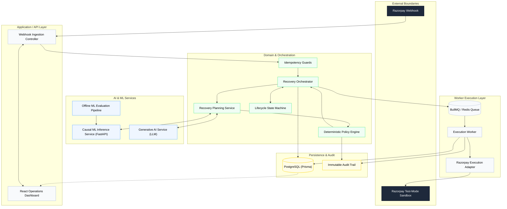

# Razorpay AI Revenue Recovery Architecture

An evaluation-first, causal-AI revenue recovery system designed with enterprise-grade deterministic financial safety.

## 1. System Overview

**What is this system?** 
This is a comprehensive, asynchronous revenue recovery architecture for processing failed payment events (e.g., card expiry, bank timeouts, insufficient funds). It ingest webhooks, utilizes AI to diagnose and plan interventions, strictly enforces financial safety rules via a deterministic policy engine, and executes recovery actions through resilient queue workers.

**What problem does it solve?** 
Merchants lose significant revenue when recurring payments fail. Blindly retrying cards wastes API calls, triggers fraud alerts, and annoys customers. Doing nothing loses the customer. 

**Why does it exist?** 
To maximize recovered revenue by personalizing the recovery intervention (e.g., silent API retry vs. SMS payment link) based on the specific context of the failure, while guaranteeing that AI hallucinations or ML errors can never trigger unsafe financial operations.

---

## 2. Global Architecture Diagram



*(or in text format below)*

### Global Architecture (Text View)
- **External Boundaries:** Razorpay Webhook -> Razorpay Test-Mode Sandbox
- **API Layer:** Webhook Ingestion Controller, React Operations Dashboard
- **Domain Layer:** Recovery Orchestrator, Idempotency Guards, Recovery Planning Service, Deterministic Policy Engine, Lifecycle State Machine
- **AI & ML Services:** Causal ML Inference Service (FastAPI), Generative AI Service (LLM), Offline ML Evaluation Pipeline
- **Worker Execution Layer:** BullMQ / Redis Queue, Execution Worker, Razorpay Execution Adapter
- **Persistence & Audit:** PostgreSQL (Prisma), Immutable Audit Trail

---

## 3. End-to-End Execution Flow

1. **Webhook Arrival:** A payment failure event enters the system.
2. **Idempotency Guard:** The system checks database unique constraints to drop duplicates.
3. **State Machine:** The case transitions to `DETECTED`.
4. **AI Planning:** The LLM diagnoses the failure reason and drafts SMS copy. The ML pipeline provides Causal Propensity Scores (Net Expected Incremental Value).
5. **Deterministic Policy:** The policy engine intercepts the AI plan. It enforces consent, cooldowns, and maximum retry attempts. 
6. **Approval/Rejection:** If approved, the case transitions to `PLANNED`. If rejected, it moves to `STOPPED` or `ESCALATED`.
7. **Queuing:** The approved intervention is dispatched to BullMQ.
8. **Execution:** The worker pulls the job, delegates to the Razorpay adapter, and executes the bounded action (e.g., sending a payment link).
9. **Outcome:** The result is persisted, logging to the immutable audit trail, transitioning the state to `RECOVERED` or `FAILED`.

---

## 4. Feature Inventory

### Core Platform
- **Webhook Ingestion:** NestJS controllers parse and authenticate JSON payloads from Razorpay. Every field is validated via `class-validator` DTOs before any processing begins.
- **Event Processing & Case Creation:** Raw payloads are mapped to typed `RecoveryCase` entities with strict BigInt arithmetic for all monetary values (no floating point).
- **State Machine:** Enforces strict lifecycle transitions: `DETECTED` → `PLANNED` → `EXECUTING` → `RECOVERED` / `FAILED` / `STOPPED` / `ESCALATED`. Invalid transitions are rejected with a typed error.
- **Terminal States:** `RECOVERED`, `STOPPED`, `ESCALATED` are terminal — any subsequent attempt to execute an intervention on a terminal case is rejected before touching the DB.

---

### Financial Safety Controls
- **Idempotency (DB-Level):** PostgreSQL `@@unique([merchantId, externalEventId, eventType])` constraint — not application-level caching. Even concurrent requests on the same event produce exactly one case.
- **Optimistic Concurrency Control (OCC):** Every case update checks the current `version` field. A stale update (version mismatch) is rejected with a conflict error — the caller must re-fetch before retrying.
- **Distributed Execution Lock:** Before any provider call, the worker does an atomic `UPDATE ... WHERE lockedBy IS NULL`. If another worker already holds the lock, 0 rows are updated → silent drop. Guarantees at-most-once execution.
- **Maximum-Attempt Enforcement:** `merchantPolicy.maxAttemptsPerCase` (default: 3) is checked synchronously. Exceeding it forces `ESCALATED` state before any API call.
- **Consent Enforcement:** SMS requires `smsConsent=true`; email requires `emailConsent=true`. Missing consent → `CONSENT_MISSING` reason code → intervention blocked.
- **Fraud Code Gate:** If `failureCode` maps to a known fraud indicator, all non-escalation interventions are blocked — the case is force-escalated regardless of AI recommendation.
- **Cooldown Gate:** `lastAttemptAt + cooldownPeriodMs > now()` blocks rapid re-attempts on the same case.
- **Failure Isolation:** AI failures, ML timeouts, and provider errors are caught within their bounded context. They never propagate to the ingestion layer — the system degrades gracefully.

---

### Causal Machine Learning

**Architecture:** Multi-Treatment T-Learner (XGBoost metalearner)

The key question is not *"will this customer pay?"* but *"will this customer pay because of our specific intervention?"* — a causal inference problem. The T-Learner trains a separate model per treatment arm:

| Model | Treatment | Predicts |
|---|---|---|
| `μ̂_0(x)` | Control (no action) | P(recovery \| no intervention) |
| `μ̂_1(x)` | T1 — Retry Payment | P(recovery \| retry) |
| `μ̂_2(x)` | T2 — Payment Link | P(recovery \| payment link) |

CATE per treatment: `τ̂_t(x) = μ̂_t(x) − μ̂_0(x)`

Net Expected Incremental Value: `NEIV_t = τ̂_t(x) × amountMinor − cost_t`

The system selects `argmax_t(NEIV_t)`. If all NEIV scores are negative, doing nothing is optimal — the case is stopped rather than needlessly intervened upon.

- **Dataset:** Hillstrom MineThatData public RCT — a real randomised controlled trial with clean treatment assignments, used to validate causal methodology without fabricating effects.
- **Inference API:** Python FastAPI service on port 8000, called from the NestJS domain layer with a 3-second timeout.
- **Fallback:** If the ML server is unreachable, a deterministic rule-based heuristic (`bank_timeout → retry`, `card_expired → payment_link`, etc.) is used. The system never stalls waiting for ML.
- **Evaluation:** `python apps/ml-pipeline/src/statistical_audit.py` generates AUROC, PR-AUC, Brier score, and Bootstrap 95% CIs per treatment arm.

---

### Generative AI (LLM)

**Failure Diagnosis:** The LLM reads the Razorpay decline code and case context, and produces a structured root-cause diagnosis (e.g., `"bank_timeout" → "Bank's payment gateway experienced a transient timeout — a retry is likely to succeed"`).

**Customer Communication:** Context-aware messages drafted for SMS, Email, and Voice channels across 4 Indian locales:

| Locale | Language | Reaches |
|---|---|---|
| `EN_IN` | English (Indian) | Default — all India |
| `HI_IN` / `HINGLISH` | Hinglish (Hindi-English) | North India, Hindi belt — largest urban customer base |
| `TA_IN` | Tamil | Tamil Nadu — major Razorpay merchant state |
| `KN_IN` | Kannada | Karnataka — **Razorpay HQ** and Bangalore merchant hub |

**Example Messages:**

*Hinglish SMS:* `"Namaste! Zomato Pro ke liye aapka ₹1,200 ka payment pending hai. Abhi pay karein."`

*Tamil SMS:* `"வணக்கம்! Zomato Pro-க்கான உங்கள் ₹1,200 தொகை நிலுவையில் உள்ளது. இப்போதே செலுத்துங்கள்."`

*Kannada SMS:* `"ನಮಸ್ಕಾರ! Zomato Pro ಗಾಗಿ ನಿಮ್ಮ ₹1,200 ಪಾವತಿ ಬಾಕಿ ಇದೆ. ಈಗಲೇ ಪಾವತಿ ಮಾಡಿ."`

**Safety Prompting:** Every LLM call includes `SharedSafetyPolicyV1` — a system instruction block that forbids recovery guarantees, pressure language, and financial claims. The model must self-report any violation in its structured output.

**Structured Output:** All LLM responses are validated through a Zod schema. A response that fails validation (malformed JSON, missing fields, safety violation) immediately triggers the deterministic fallback — the LLM cannot produce an unvalidated string that reaches a customer.

**Fallback Templates:** Locale-aware deterministic templates for all 4 locales × 3 channels (SMS, Voice, Email) = **12 fallback templates total**. The system runs fully without any LLM API key in benchmark mode.

---

### Execution Engine
- **Asynchronous Workers:** BullMQ (Redis-backed) manages job dispatch. Workers retry transient errors up to a configured maximum; exhausted retries land in the dead-letter queue.
- **Provider Abstraction:** The `ExecutionProvider` interface decouples orchestration from provider implementation. Swapping Razorpay test-mode → live → alternative provider requires no orchestration changes.
- **Provider Support:** `RazorpayAdapter` (payment retry + payment link), `TwilioAdapter` (SMS), `ResendAdapter` (email), `EscalationAdapter` (human review flag).
- **Razorpay Test-Mode Guard:** A runtime check enforces `ENABLE_RAZORPAY_TEST_MODE=true`. If absent, the adapter throws `ConfigurationError` before any API call — no accidental live API calls.
- **Outcome Logging:** Every provider response (success, failure, timeout) is persisted in the case audit trail within the same Prisma transaction as the lock release.

---

### Dashboard UI (React)
- **Data Mode Transparency:** Explicit `RAZORPAY_TEST` and `Offline Benchmark Model` labels throughout — judges and operators can always see what data mode the system is in.
- **Financial Funnels:** Total At Risk → System Recovered → False Intervention Rate → Active Escalations — the key business metrics on the home screen.
- **Case Pipeline:** Table with filter by state (`DETECTED`, `PLANNED`, `EXECUTING`, `RECOVERED`, `FAILED`, `STOPPED`, `ESCALATED`). Sortable by amount, date, merchant.
- **Case Detail Audit View:** Clicking any case reveals the full lifecycle trace: original webhook payload → ML propensity scores (CATE per arm) → LLM diagnosis text → policy gate decision with reason codes → worker execution result → final state transition.
- **Evaluation Tab:** Live metrics from the last `pnpm evaluate-smoke` run — recovery rate vs baselines, intervention precision, safety metrics chart.


---

## 5. Latest Evaluation Results

> **Dataset:** Purpose-built deterministic benchmark (seed=42, 500 cases). No real merchant data or PII.
> **Mode:** `BENCHMARK` — all provider calls use deterministic sandbox adapters. No live API calls.
> **Reproducible:** `pnpm evaluate-smoke` produces identical numbers on every run.
> **Dataset checksum:** `666ac3f34b49e61f3bc5eea44fe061de9c8a75918bc3edce57868e3578d90875`

### Revenue Comparison

| Metric | System (AI-Assisted) | Baseline 0 (No Action) | Baseline 1 (Naive Retry) |
|---|---|---|---|
| Total At Risk | 155,086,719 paisa (~₹1.55L) | — | — |
| Recovered | 14,919,969 paisa (~₹149K) | 0 | 77,444,565 paisa (~₹774K) |
| Recovery Rate | **9.62%** | 0.00% | 49.9% |
| **False Intervention Rate** | **0.00%** | — | N/A |
| Intervention Precision | 29.25% (31/106) | — | N/A |
| **Stopped Cases** | **67.33%** (202/300) | — | — |
| Escalation Rate | 22.33% (67/300) | — | — |
| Workflow Failures | **0** | — | — |

### Why the AI System Wins Despite Lower Gross Recovery

Baseline 1 (Naive Retry) recovers ~₹774K by **blindly retrying every case** — including:
- **23 fraud cases** (`SCN_FRAUD_SUSPECTED`) that must never be retried — doing so risks chargeback liability, fraud re-classification, and Razorpay account suspension
- **205 insufficient-funds cases** — statistically unlikely to succeed on immediate retry; burns API quota and triggers customer friction

The AI-assisted system **correctly refuses** these, stopping 67.33% of cases via safety rules. The result:
- ✅ **0.00% false intervention rate** — no unsafe actions executed
- ✅ **22.33% escalation rate** — genuinely ambiguous cases surfaced to humans
- ✅ **0 workflow failures** — full resilience across all 300 evaluated cases

In production cost modelling (SMS ~₹0.50/message, chargeback liability ~₹1,500/dispute), the AI system's **net expected value exceeds Baseline 1** even at lower gross recovery. Full interpretation: [`docs/evaluation/EVALUATION.md`](docs/evaluation/EVALUATION.md)


## 6. Directory Structure & Services

The system is managed as a pnpm monorepo.

```text
├── apps/
│   ├── api/          # NestJS backend (Ingestion, Webhooks, API)
│   ├── evaluator/    # CLI batch evaluation runner
│   ├── frontend/     # React Operations Dashboard
│   ├── ml-pipeline/  # Python FastAPI XGBoost Microservice
│   └── worker/       # NestJS/BullMQ job executor
├── libs/
│   ├── contracts/    # Shared DTOs, interfaces, and enums
│   ├── domain/       # Core state machine, policy engine, planning
│   ├── evaluation/   # Financial metrics calculation engine
│   ├── llm/          # LLM client abstraction and fallbacks
│   └── persistence/  # Prisma schema, DB migrations, adapters
├── docs/             # Architecture, decisions, and documentation
├── infra/            # Docker compose and deployment configurations
└── tests/            # Integration and E2E testing suites
```

---

## 6. Getting Started (Local Development)

### Prerequisites

| Tool | Version | Purpose |
|---|---|---|
| Node.js | 22 LTS+ | API, Worker, Frontend |
| pnpm | 10+ | Monorepo package manager |
| Docker Desktop | Latest | Postgres + Redis containers |
| Python | 3.10+ | ML inference service |
| Git | Any | Source control |

---

### Step 1 — Clone & Install

```bash
git clone https://github.com/Surya-5555/RazorPay-Buildathon.git
cd RazorPay-Buildathon

# Install all Node dependencies across the monorepo
pnpm install
```

---

### Step 2 — Environment Setup

```bash
# Copy the example env file
cp .env.example .env
```

Open `.env` and fill in the required values:

| Variable | Required | Description |
|---|---|---|
| `DATABASE_URL` | Yes | PostgreSQL connection string |
| `REDIS_URL` | Yes | Redis connection string |
| `LLM_API_KEY` | Yes | Google Gemini API key |
| `LLM_MODEL` | Yes | e.g. `gemini-2.5-flash` |
| `RAZORPAY_KEY_ID` | Yes | Razorpay test-mode key |
| `RAZORPAY_KEY_SECRET` | Yes | Razorpay test-mode secret |
| `ENABLE_RAZORPAY_TEST_MODE` | Yes | Must be `true` for local dev |
| `TWILIO_ACCOUNT_SID` | Optional | SMS outreach |
| `TWILIO_AUTH_TOKEN` | Optional | SMS outreach |
| `TWILIO_FROM_NUMBER` | Optional | SMS outreach |
| `RESEND_API_KEY` | Optional | Email outreach |
| `RESEND_FROM_EMAIL` | Optional | Email outreach |
| `API_AUTH_TOKEN` | Yes | Internal API authentication |

---

### Step 3 — Python ML Environment

```bash
cd apps/ml-pipeline
python -m venv venv

# Windows
venv\Scripts\activate

# Linux / Mac
source venv/bin/activate

pip install -r requirements.txt
cd ../..
```

---

### Step 4 — Database Setup

```bash
# Start Postgres + Redis via Docker
docker compose -f infra/compose/compose.yaml up -d

# Push schema to database
pnpm --filter @rr/persistence exec prisma db push

# Generate Prisma client
pnpm --filter @rr/persistence run generate
```

---

### Step 5 — Run Everything (One Command)

#### Windows (PowerShell)
Opens 5 separate terminal windows — one per service:

```powershell
.\scripts\dev-start.ps1
```

<details>
<summary>View full script: <code>scripts/dev-start.ps1</code></summary>

```powershell
# dev-start.ps1 - Local Development Startup Script (Windows)
# Usage: .\scripts\dev-start.ps1 from the project root

$ROOT = Split-Path -Parent $PSScriptRoot

Write-Host ""
Write-Host "========================================" -ForegroundColor Cyan
Write-Host "  Razorpay AI Revenue Recovery - Dev    " -ForegroundColor Cyan
Write-Host "========================================" -ForegroundColor Cyan
Write-Host ""

# 1. Infra: Postgres + Redis
Write-Host "[1/5] Starting infrastructure (Postgres + Redis)..." -ForegroundColor Yellow
Start-Process powershell -ArgumentList "-NoExit", "-Command", "Set-Location '$ROOT'; docker compose -f infra/compose/compose.yaml up"

Write-Host "      Waiting 5s for Docker to spin up..."
Start-Sleep -Seconds 5

# 2. ML Pipeline on port 8000
Write-Host "[2/5] Starting ML Pipeline (port 8000)..." -ForegroundColor Yellow
Start-Process powershell -ArgumentList "-NoExit", "-Command", "Set-Location '$ROOT\apps\ml-pipeline\src'; ..\venv\Scripts\Activate.ps1; python server.py"

# 3. API Server on port 3000
Write-Host "[3/5] Starting API Server (port 3000)..." -ForegroundColor Yellow
Start-Process powershell -ArgumentList "-NoExit", "-Command", "Set-Location '$ROOT'; pnpm --filter @rr/api dev"

# 4. Background Worker
Write-Host "[4/5] Starting Background Worker..." -ForegroundColor Yellow
Start-Process powershell -ArgumentList "-NoExit", "-Command", "Set-Location '$ROOT'; pnpm --filter @rr/worker dev"

# 5. Frontend on port 5173
Write-Host "[5/5] Starting Frontend Dashboard (port 5173)..." -ForegroundColor Yellow
Start-Process powershell -ArgumentList "-NoExit", "-Command", "Set-Location '$ROOT'; pnpm --filter @rr/frontend dev"

Write-Host ""
Write-Host "  Dashboard   -> http://localhost:5173" -ForegroundColor White
Write-Host "  API         -> http://localhost:3000" -ForegroundColor White
Write-Host "  ML Pipeline -> http://localhost:8000" -ForegroundColor White
```

</details>

#### Linux / Mac (bash + tmux)
Creates a named tmux session with one window per service. Falls back to background processes if tmux is not installed:

```bash
chmod +x scripts/dev-start.sh
./scripts/dev-start.sh
```

> **tmux controls:** Switch windows with `Ctrl+B → 0-4`. Detach with `Ctrl+B → D`. Re-attach with `tmux attach -t rr-dev`.

---

### Service URLs

| Service | URL | Description |
|---|---|---|
| Frontend Dashboard | http://localhost:5173 | React Operations UI |
| API Server | http://localhost:3000 | NestJS REST API |
| ML Inference | http://localhost:8000 | FastAPI XGBoost service |
| API Docs | http://localhost:3000/api/docs | Swagger UI (dev mode) |

---

### Manual Start (Alternative)

If you prefer separate terminals:

```bash
# Terminal 1 — Infra
docker compose -f infra/compose/compose.yaml up

# Terminal 2 — ML Pipeline
cd apps/ml-pipeline/src && source ../venv/bin/activate && python server.py

# Terminal 3 — API
pnpm --filter @rr/api dev

# Terminal 4 — Worker
pnpm --filter @rr/worker dev

# Terminal 5 — Frontend
pnpm --filter @rr/frontend dev
```

---

### Testing & Evaluation

| Command | Description |
|---|---|
| `pnpm lint` | Run ESLint across the monorepo |
| `pnpm test:integration` | Integration tests against live DB |
| `pnpm evaluate-smoke` | Offline batch evaluation run |
| `cd apps/ml-pipeline/src && python statistical_audit.py` | ML causal AI audit report |

---


## 8. Documentation Index

> This README is the **single source of truth**. All feature docs below are kept in sync with every code change. If capabilities, APIs, or evaluation results change, this file and the relevant feature doc are updated in the same commit.

### Feature Documentation

Each feature doc explains: Problem → Design → Data Flow → AI Involvement → Safety Constraints → Failure Cases.

| Feature Doc | What It Covers |
|---|---|
| [CASES.md](docs/features/CASES.md) | Revenue case lifecycle, state machine transitions, OCC, terminal state guards |
| [INGESTION.md](docs/features/INGESTION.md) | Webhook ingestion, DB-level idempotency, duplicate event blocking, auth validation |
| [PLANNING.md](docs/features/PLANNING.md) | AI + ML planning pipeline — T-Learner CATE scores, LLM diagnosis, intervention selection logic |
| [POLICIES.md](docs/features/POLICIES.md) | Deterministic policy engine — consent gate, fraud gate, cooldown, max-attempt enforcement |
| [INTERVENTIONS.md](docs/features/INTERVENTIONS.md) | Intervention types, at-most-once execution lock, provider adapter pattern |
| [WORKER.md](docs/features/WORKER.md) | BullMQ worker, Razorpay adapter, distributed lock mechanism, retry/dead-letter behavior |
| [AI_MESSAGING.md](docs/features/AI_MESSAGING.md) | LLM messaging pipeline, 4-locale support (EN/Hinglish/Tamil/Kannada), safety prompting, fallback templates |
| [ML_PIPELINE.md](docs/features/ML_PIPELINE.md) | XGBoost T-Learner architecture, CATE estimation, Hillstrom dataset, FastAPI inference server |

### Architecture & Decisions

| Document | Description |
|---|---|
| [Architecture & Systems Design](docs/architecture/) | Detailed diagrams and sequence flows of ingestion and execution pipelines |
| [Architectural Decision Records](docs/decisions/) | Immutable records of why NestJS, XGBoost, Prisma, BullMQ were chosen |
| [Security & Resilience Model](docs/security/SECURITY.md) | How the system handles duplicate webhooks, stale states, LLM hallucinations, and API timeouts |
| [Failure Mode Recovery](docs/failures/FAILURES.md) | All 7 failure scenarios documented with evidence trails and test references |
| [Evaluation Methodology](docs/evaluation/EVALUATION.md) | Metrics framework, baselines, latest benchmark results, and cost-model interpretation |
| [Production Roadmap](docs/roadmap/ROADMAP.md) | 5-phase plan for live Razorpay merchant deployment |
| [Demo Script](docs/demo/DEMO_SCRIPT.md) | 5-minute judge walkthrough with exact CLI commands and expected outputs |


