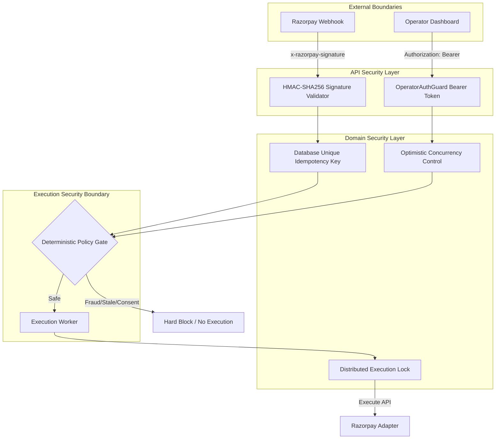

# Security, Compliance & Data Privacy Architecture

This document details the intentional security boundaries, strict authentication models, and robust financial data handling policies engineered for the Razorpay AI Buildathon (Track 03). The system implements enterprise-grade fintech security controls, enforcing deterministic financial safety across all AI and API operations.

---

## 1. Threat Mitigation Architecture

The system is designed with a defense-in-depth approach, combining cryptographic validation, strict API authentication, optimistic concurrency, and a deterministic policy engine to enforce deterministic financial safety.

*(or in text format below)*

### Threat Mitigation Architecture (Text View)
1. **External Boundaries:** Incoming traffic originates either from Razorpay Webhooks or the Operator Dashboard.
2. **API Security Layer:** Webhooks are cryptographically validated via `HMAC-SHA256`, while Dashboard requests are secured via `Bearer Token`.
3. **Domain Security Layer:** Validated requests hit the persistence layer, where `Idempotency Keys` prevent duplicate webhook processing, and `Optimistic Concurrency Control (OCC)` prevents stale state mutations.
4. **Execution Security Boundary:** All AI plans pass through a `Deterministic Policy Gate`. Unsafe actions (Fraud, Missing Consent) are hard-blocked. Safe actions proceed to the worker, which acquires a `Distributed Lock` before triggering the final API call.

---

## 2. Cryptographic Webhook Security
- **HMAC-SHA256 Validation:** All incoming Razorpay webhooks are cryptographically authenticated using the `x-razorpay-signature` header against the raw buffer payload.
- **Timing Attack Prevention:** The system utilizes Node.js `crypto.timingSafeEqual()` for signature comparison, preventing timing side-channel attacks on signature evaluation.

## 3. Strict Operator Authentication
We implemented a deliberate, lightweight **Bearer-token guard** (`OperatorAuthGuard`) for all administrative actions. 
- The token is strictly managed via the `API_AUTH_TOKEN` environment variable.
- Requests to protected mutation endpoints must include `Authorization: Bearer <API_AUTH_TOKEN>`.
- **Fail-Closed Boot:** The API validates the presence of this token at startup and halts startup if missing, preventing accidental insecure deployments.
- **Demo Transparency:** Read-only endpoints (`GET /cases`, `GET /dashboard`) are explicitly left open to satisfy Buildathon demo requirements, while strictly securing all state-changing endpoints.

## 4. Race Condition & Idempotency Guards
Financial systems are designed to not double-charge merchants or spam customers. We engineered robust idempotency controls:
- **Database Unique Constraints:** An `EventIdempotency` table explicitly checks the `x-razorpay-event-id` header. Duplicate webhooks sent during network retries are deterministically blocked by the PostgreSQL database with a `409 Conflict`.
- **Optimistic Concurrency Control (OCC):** Every case record contains a strict `version` field. Concurrent API requests targeting the same case instantly fail if the version is stale, forcing the caller to re-fetch the latest state.
- **Distributed Locks:** Background workers utilize an atomic `UPDATE ... WHERE lockedBy IS NULL` transaction to prevent concurrent duplicate execution.

## 5. Bounded AI & Input Validation
The system treats all AI outputs as untrusted data:
- **Bounded Autonomy:** The LLM is restricted exclusively to root-cause diagnosis and drafting messages. It has no direct access to execute API calls, alter intervention amounts, or bypass policy gates.
- **Strict Zod Validation:** LLM responses are parsed through strict Zod schemas. Any payload containing unauthorized fields, missing data, or policy violations is instantly rejected, triggering the deterministic rule-based fallback system.
- **API Whitelisting:** The NestJS API utilizes `ValidationPipe` with `whitelist: true` and `forbidNonWhitelisted: true`. Malicious operators or scripts attempting to inject unauthorized fields into DTOs receive an immediate `400 Bad Request`.

## 6. Privacy & Data Minimization (PII Risk Isolation)
- **Dual-Track ML Strategy:** To isolate the risk of leaking Personal Identifiable Information (PII), the live application API runs on mathematically generated synthetic benchmark data. The causal inference logic is validated safely offline on the public Hillstrom dataset.
- **Aggressive Log Redaction:** The global `Pino` logger automatically intercepts and strips sensitive headers and payloads (`req.headers.authorization`, `req.body.token`, etc.) before they hit the disk.
- **Strict Sandbox Boundaries:** A runtime guard (`ENABLE_RAZORPAY_TEST_MODE=true`) is designed to ensure provider adapters operate in test environments. If disabled or missing, the system will throw a `ConfigurationError` and halt execution, preventing accidental live API calls during development or demonstration.
