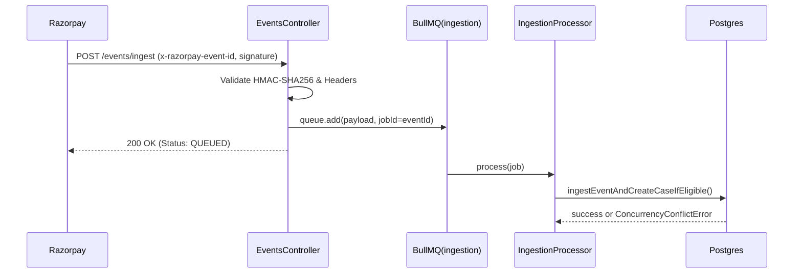

# Event Ingestion Architecture

This module handles the ingestion of Razorpay Webhook events.

## Design Philosophy
We prioritize absolute deterministic financial safety, resilience, and strict adherence to API specifications. Webhooks are a critical boundary where external state enters our system, so they must be ingested reliably without blocking.

## Core Mechanisms

### 1. Strict Header-Based Idempotency
- **Header Enforcement**: All incoming `POST /events/ingest` requests MUST include the `x-razorpay-event-id` header.
- **Deduplication**: We map this header directly to BullMQ's `jobId` and the internal idempotency key. This ensures at-most-once processing at the queue layer and the database layer. We explicitly removed deterministic hashing fallbacks to avoid silent collisions or malformed state.

### 2. Asynchronous Queue Decoupling (The 5-Second Rule)
- Razorpay expects a `200 OK` within 5 seconds of dispatching a webhook.
- To guarantee this, the `EventsController` performs **zero synchronous database writes**. 
- It validates the HMAC-SHA256 signature and idempotency header, then enqueues the payload onto the BullMQ `ingestion` queue.
- The `IngestionProcessor` background worker consumes these events and invokes the deterministic DB writes (`ingestEventAndCreateCaseIfEligible`) safely, handling `ConcurrencyConflictError` seamlessly.

## Mermaid Diagram

*(or in text format below)*
1. Razorpay sends the webhook to the EventsController.
2. The controller validates the HMAC signature and the required `x-razorpay-event-id` header.
3. The payload is pushed to the BullMQ `ingestion` queue, using the event ID for deduplication.
4. The controller immediately responds to Razorpay with a `200 OK`.
5. In the background, the `IngestionProcessor` pulls the job and executes the database ingestion.
