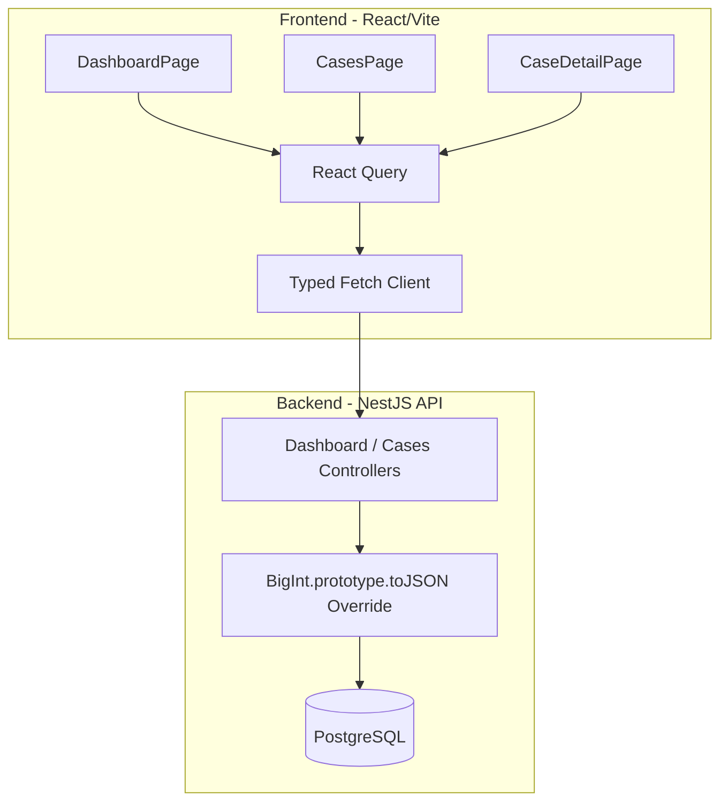

# Feature: Reviewer-First Operations Console

## 1. Problem & Motivation
The system lacked an explicit, internal operations console to visualize and prove the robustness of the revenue recovery workflows. To demonstrate engineering depth and provide a comprehensive operational audit tool for reviewers in a short period (under five minutes), a dedicated, evidence-driven frontend dashboard was required. It needed to expose core financial metrics, trace the immutable audit logs of individual revenue cases, and prove the deterministic safety constraints implemented in the backend.

## 2. Design & Architecture
The dashboard is built within the React 18 / Vite frontend and leverages `@tanstack/react-query` to fetch real-time data from the NestJS API. It avoids heavy state-management libraries to maintain simplicity and performance.

*(or in text format below)*

### Architecture Flow (Text View)
- **Frontend (React/Vite):** Core views like `DashboardPage`, `CasesPage`, and `CaseDetailPage` use React Query for state management and caching.
- **Data Fetching:** A strongly typed fetch client handles API communication.
- **Backend (NestJS API):** Controllers serve the data directly from the PostgreSQL database, utilizing a global `BigInt` override to safely serialize monetary fields without crashing.

### Key Components Built
- **Executive Recovery Dashboard (`DashboardPage.tsx`)**: Displays aggregate financial metrics (Total Revenue at Risk, Baseline vs. System Recovered, Incremental Recovery, False Intervention Rates) and a funnel visualization mapping states from `DETECTED` to `RECOVERED` or `STOPPED`.
- **Revenue Cases Table (`CasesPage.tsx`)**: Offers a paginated list of all recovery cases with clear status indicators, risk scores, root cause tags, and proposed interventions.
- **Case Detail & Audit Timeline (`CaseDetailPage.tsx`)**: Presents an immutable chronological timeline of all AI reasoning and system actions, explicitly labeling AI-generated diagnosis/plans and exposing execution outcomes and failure details.
- **Evaluation Run View (`EvaluationRunsPage.tsx`)**: Exposes historical batch evaluation metrics, separating baseline recovery from incremental AI-driven recovery and proving precision limits.
- **Failure & Safety Proofs (`FailuresPage.tsx`)**: Highlights the core "Safety Cards" (Idempotency, Concurrency, etc.) and visualizes resilient controlled failure tests to prove the boundaries hold in extreme conditions.

## 3. Engineering Reasoning & Decision Choices
- **Backend Serialization Patch**: During implementation, the NestJS API crashed (HTTP 500) when serializing Prisma's `BigInt` monetary values (e.g. `amountAtRiskMinor`). A global `BigInt.prototype.toJSON` override was chosen in `main.ts` as the safest, most performant fix to cleanly bridge the ORM to the frontend without heavy DTO mapping refactors.
- **No-Trivial-Data Rule**: Rather than displaying flashy marketing metrics, the UI is hardwired to exact endpoints (`/dashboard/summary`, `/cases`) enforcing the "only evidence-driven screens" constraint. 
- **AI Transparency**: In the Case Detail page, the AI's diagnosis and planning logic are distinctly badged with an "AI-Generated" label. This explicitly proves that AI is bounded to *reasoning*, while the execution state and policy gate decisions operate independently underneath it.

## 4. Improvements to the System
By surfacing the underlying complexities of the backend's policy evaluator and distributed retry queues into a clean UI, the operations console transforms the Revenue Recovery system from a "black-box" into a highly transparent, auditable fintech product. It allows operators and reviewers to visually verify at a glance that the system accurately scales revenue recovery while strictly upholding safety limits.
