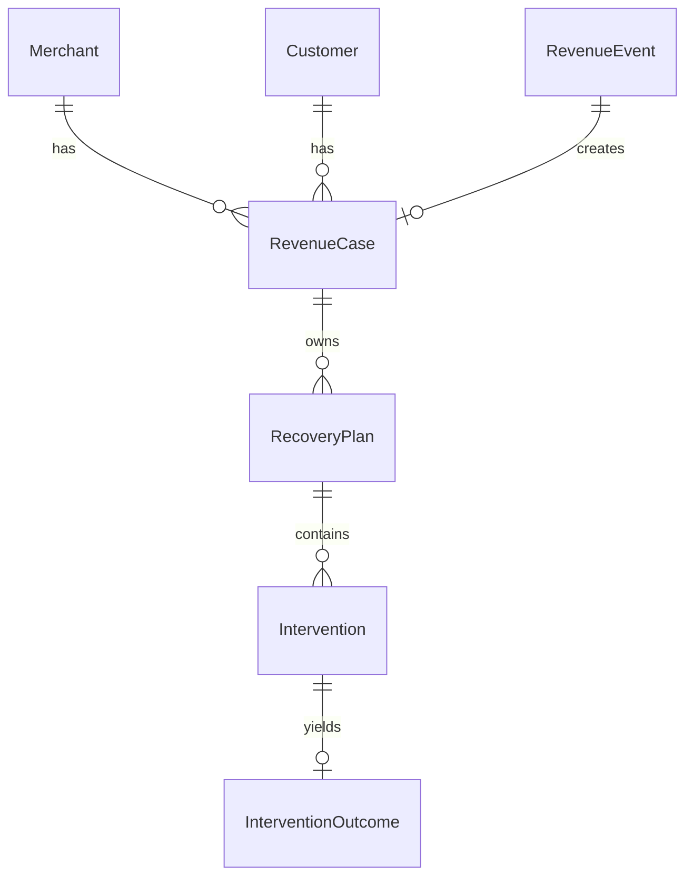

# Data Model

```mermaid
erDiagram
  Merchant ||--o{ RevenueCase : has
  Customer ||--o{ RevenueCase : has
  RevenueEvent ||--o| RevenueCase : creates
  RevenueCase ||--o{ RecoveryPlan : owns
  RecoveryPlan ||--o{ Intervention : contains
  Intervention ||--o| InterventionOutcome : yields
```

- BigInt used for all currency to avoid floating point errors.
- Version-based optimistic locking on RevenueCase state.
