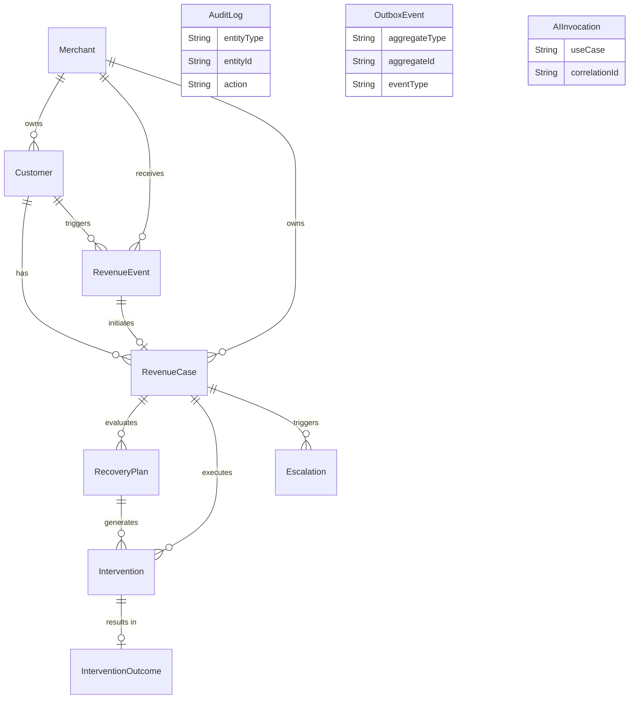

# Data Model Architecture

## Overview
The persistence layer of the Razorpay AI Revenue Recovery system is built on PostgreSQL, managed via Prisma ORM. The data model is strictly normalized and designed to enforce referential integrity, idempotency, and full historical auditability. It operates as the single source of truth for all domain state.

## Entity Relationship Diagram (ERD)

Below is the conceptual Entity Relationship Diagram mapping the strict boundaries of our PostgreSQL database:

> [!NOTE]
> `AuditLog`, `OutboxEvent`, and `AIInvocation` are intentionally decoupled from strict foreign keys to maintain extremely high write-throughput without lock contention on the parent tables.

## Core Architectural Patterns

### 1. Unique Constraints as Idempotency Barriers
Financial systems cannot afford duplicate processing. Our data model leverages hard database constraints to guarantee idempotency.
- **Ingestion Table:** The `externalEventId` alongside `eventType` on the `RevenueEvent` table is marked `@unique`. If the system receives a duplicate webhook, the database throws a constraint violation, which the persistence layer safely catches and handles as a successful no-op.
- **Transitions:** State transitions enforce optimistic locking. A case can only transition if its `version` matches the expected state, blocking race conditions between concurrent workers.

### 2. The Core Entities

1. **`RevenueEvent` (Ingestion):** An immutable, append-only ledger of every raw signal received from payment gateways. It contains the raw payload and `metadataJson`.
2. **`RevenueCase` (The Aggregate Root):** The central state machine. A single failed subscription or payment creates one `RevenueCase`. It tracks `amountAtRiskMinor`, `state` (`OPEN`, `PLANNED`, `RECOVERED`, `FAILED`), and the `attemptCount`.
3. **`RecoveryPlan` (The Strategy):** The output of the AI evaluation phase. It contains the `reasonCodesJson`, the `interventionType`, and the deterministic `policyVersion` applied.
4. **`Intervention` & `InterventionOutcome` (The Execution):** The actual bounded action taken (e.g., SMS sent). The `Intervention` handles the attempt and lock status, while `InterventionOutcome` records the success and the exact `recoveredAmountMinor`.
5. **`Escalation`:** Records cases that breached safety thresholds and were automatically stopped for human review.

### 3. Execution & Telemetry Tables

1. **`OutboxEvent`:** The queue abstraction layer guaranteeing exactly-once transactional delivery of state changes to BullMQ.
2. **`AuditLog`:** The immutable ledger recording `previousState`, `nextState`, and the `actorType` (System vs LLM) for every mutation.
3. **`AIInvocation`:** A telemetry table capturing LLM usage, storing `inputHash`, `estimatedCostMinor`, and latency to audit AI behavior without bloating the core domain tables.

### 4. JSONB for Extensibility
While core domain fields (IDs, states, amounts) are strictly typed columns, we utilize PostgreSQL's `JSONB` data type (mapped as `@db.Text` with JSON serialization in Prisma) for the `metadataJson`, `payloadJson`, and `reasonCodesJson` columns. This allows us to store arbitrary external API responses without requiring a database migration every time Razorpay updates their webhook payload structure, while preserving the strict typed schema for financial figures.

### 5. Soft Deletion & Immutability
Records in this system are rarely, if ever, deleted. Instead of `DELETE` operations, we rely on state transitions (`status = 'CANCELLED'`). `RevenueEvent` and `AuditLog` are strictly immutable; `UPDATE` statements are never executed against them in application code.
