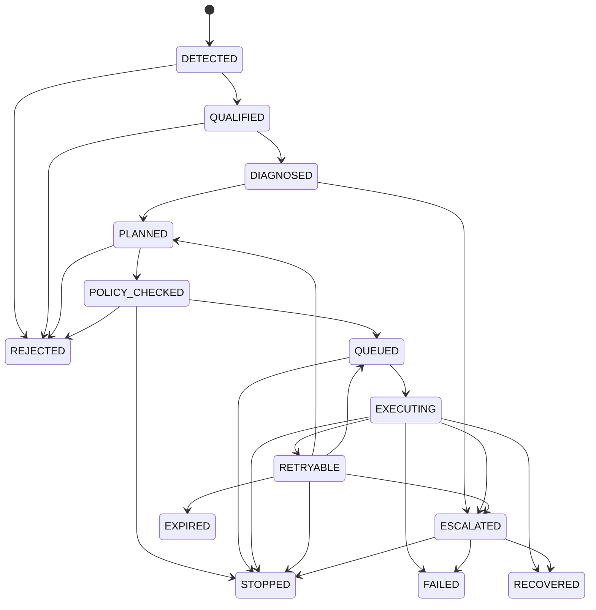

# State Machine

```mermaid
stateDiagram-v2
    [*] --> DETECTED
    DETECTED --> QUALIFIED
    DETECTED --> REJECTED
    QUALIFIED --> DIAGNOSED
    QUALIFIED --> REJECTED
    DIAGNOSED --> PLANNED
    DIAGNOSED --> ESCALATED
    PLANNED --> POLICY_CHECKED
    PLANNED --> REJECTED
    POLICY_CHECKED --> QUEUED
    POLICY_CHECKED --> REJECTED
    POLICY_CHECKED --> STOPPED
    QUEUED --> EXECUTING
    QUEUED --> STOPPED
    EXECUTING --> RECOVERED
    EXECUTING --> FAILED
    EXECUTING --> RETRYABLE
    EXECUTING --> ESCALATED
    EXECUTING --> STOPPED
    RETRYABLE --> PLANNED
    RETRYABLE --> QUEUED
    RETRYABLE --> ESCALATED
    RETRYABLE --> STOPPED
    RETRYABLE --> EXPIRED
    ESCALATED --> STOPPED
    ESCALATED --> RECOVERED
    ESCALATED --> FAILED
```

Terminal States: RECOVERED, FAILED, STOPPED, EXPIRED, REJECTED.
