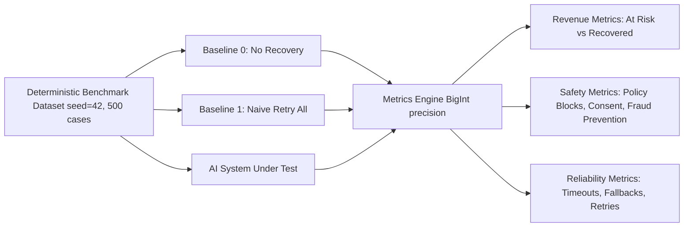

# Evaluation Framework

## Purpose

This document describes how the Revenue Recovery system is measured. The evaluation framework computes reproducible, batch-level metrics comparing the AI-assisted system against two baselines. All claims are backed by deterministic computation over a checksummed benchmark dataset.



*(or in text format below)*

### Evaluation Pipeline (Text View)
1. **Input:** A deterministic benchmark dataset (`seed=42`, 500 cases) with a SHA-256 checksum for reproducibility.
2. **Three Parallel Evaluations:**
   - **Baseline 0 (No Recovery):** Measures organic/natural recovery rate.
   - **Baseline 1 (Naive Retry):** Blindly retries every case regardless of failure reason.
   - **AI System Under Test (SUT):** Uses the full AI pipeline (diagnosis, ML scoring, policy gating, execution).
3. **Metrics Engine:** Computes all metrics using `BigInt` (minor units) to prevent floating-point precision loss.
4. **Output:** Revenue Metrics, Safety Metrics, and Reliability Metrics — all deterministically reproducible.

## Dataset

### Provenance
The evaluation dataset is **purpose-built with deterministic generation**. No real merchant data, customer PII, or production transaction records are used.

- **Generation**: Created deterministically via `scripts/generate_evaluation_dataset.ts` using a deterministic PRNG (Linear Congruential Generator)
- **Seed**: `42` (fixed — every run produces identical data)
- **Cases**: 500 total
- **Checksum**: `666ac3f34b49e61f3bc5eea44fe061de9c8a75918bc3edce57868e3578d90875` (SHA-256 of concatenated records)

### Splits
| Split | File | Count | Purpose |
|-------|------|-------|---------|
| Train | `train.jsonl` | ~165 | Strategy calibration |
| Validation | `validation.jsonl` | ~165 | Hyperparameter tuning |
| Held-out | `heldout.jsonl` | ~170 | Final reported metrics |

### Scenario Distribution
| Scenario | Count | Description |
|----------|-------|-------------|
| `SCN_INSUFFICIENT_FUNDS` | 205 | Customer lacks funds — retry unlikely to help |
| `SCN_BANK_TIMEOUT` | 94 | Bank-side timeout — retry may succeed |
| `SCN_CARD_EXPIRED` | 71 | Card expired — needs payment link |
| `SCN_DO_NOT_HONOR` | 54 | Bank refused — needs investigation |
| `SCN_INVALID_CVV` | 53 | CVV mismatch — needs customer action |
| `SCN_FRAUD_SUSPECTED` | 23 | Fraud flag — must NOT retry |

### Ground Truth
Each benchmark evaluation case contains:
- `expectedRecoverable`: boolean indicating whether the case is recoverable given the scenario
- `expectedBestChannel`: the intervention channel with highest expected success rate
- `amountMinor`: the amount at risk in minor currency units (paisa)

Ground truth is generated by the dataset generator and is deterministic for the fixed seed.

## Baselines

### Baseline 0: No Recovery
Do nothing. Measures the organic/natural recovery rate — the fraction of cases that resolve without any intervention.

### Baseline 1: Naive Retry
A simple rule-based strategy that blindly retries the first allowed channel for every case, regardless of failure reason. This is what a merchant without AI-assisted recovery would typically do.

## System Under Test (SUT)
The AI-assisted system which:
1. Diagnoses the failure root cause
2. Selects an appropriate intervention channel based on scenario
3. Validates against merchant policy and customer consent
4. Executes the intervention (or blocks it if unsafe)
5. Records the outcome

## Metrics

All monetary calculations use `BigInt` (minor units) to prevent floating-point precision loss.

### Revenue Metrics
| Metric | Formula |
|--------|---------|
| Total At Risk | `Σ case.amountMinor` |
| System Recovered | `Σ sut_result.recoveredAmountMinor` |
| Baseline 0 Recovered | `Σ baseline0_result.recoveredAmountMinor` |
| Baseline 1 Recovered | `Σ baseline1_result.recoveredAmountMinor` |
| Incremental vs B0 | `systemRecovered - baseline0Recovered` |
| Incremental vs B1 | `systemRecovered - baseline1Recovered` |
| Recovery Rate | `systemRecovered / totalAtRisk` |

### Intervention Metrics
| Metric | Formula |
|--------|---------|
| Precision | `succeeded / attempted` |
| False Intervention Rate | `falseInterventions / attempted` |
| Average Attempts Per Case | `totalAttempted / totalCases` |

### Safety Metrics
| Metric | Description |
|--------|-------------|
| Policy Blocks | Interventions rejected by policy engine |
| Consent Blocks | Interventions blocked due to missing customer consent |
| Escalation Rate | `escalations / totalCases` |
| Stopped Case Rate | `stoppedCases / totalCases` |
| Unsafe Actions Prevented | Actions blocked by deterministic safety rules (e.g., retrying fraud) |
| Stale Actions Prevented | Actions blocked by optimistic concurrency control |
| Idempotent Replays | Duplicate execution attempts detected and blocked |

### Reliability Metrics
| Metric | Description |
|--------|-------------|
| Provider Timeouts | External API timeouts encountered |
| Provider Retries | External API retries attempted |
| Provider Final Failures | Retries exhausted without success |
| AI Fallback Count | Times the LLM was unavailable and fallback templates were used |

### Integrity Assertions
The evaluation automatically fails if:
- `systemRecovered > totalAtRisk` (cannot recover more than was lost)
- Any BigInt calculation produces negative amounts where not expected

## Running the Evaluation

```bash
# Run the batch evaluation (no external API calls needed)
pnpm evaluate-smoke

# Or via Make
make evaluate
```

Output is rendered directly to the CLI stdout as a JSON report containing all metrics above.

---

## Latest Evaluation Run Results

> **Data**: Purpose-built deterministic benchmark dataset (seed=42, 500 cases).
> **Mode**: `BENCHMARK` — all provider calls use deterministic sandbox adapters. No live API calls.
> **Reproducible**: `pnpm evaluate-smoke` produces identical numbers on every run.
> **Dataset checksum**: `666ac3f34b49e61f3bc5eea44fe061de9c8a75918bc3edce57868e3578d90875`

<!-- EVALUATION_RESULTS_START -->
## Run Configuration
- **Dataset Version**: 1.0.0
- **Dataset Checksum**: d659a33b911118706d5cc4e6c206a92ef12557d5dfe8f06e1d5aa056155decd8
- **Held-Out Case Count**: 500

## Money Metrics
- **Total At Risk**: 44357358
- **Naturally Recovered**: 0
- **Baseline 1 Recovered**: 22116004
- **System Recovered**: 9185069
- **Incremental vs Baseline 0**: 9185069
- **Incremental vs Baseline 1**: -12930935
- **Recovery Rate**: 20.71%

## Net ROI (Value minus Costs & Penalties)
- **Baseline 1 Gross Recovered**: 22116004
- **Baseline 1 Total Cost**: 459600 (including 3 fraud chargebacks)
- **Baseline 1 Net ROI**: 21656404
- **System Gross Recovered**: 9185069
- **System Total Cost**: 6600 (including 0 fraud chargebacks)
- **System Net ROI**: 9178469
- **Incremental Risk-Adjusted Value (System vs B1)**: -12477935


## Intervention Metrics
- **Attempted**: 132
- **Succeeded**: 35
- **Precision**: 26.52%
- **Failed**: 97 (73.48%)
- **False Interventions**: 0 (0.00%)
- **Avg Attempts Per Case**: 0.78

## Safety & Compliance
- **Policy Blocks**: 38
- **Escalations**: 97 (57.06%)
- **Stopped Cases**: 38 (22.35%)
- **Unsafe Prevented**: 0
- **Stale Prevented**: 0
- **Consent Blocks**: 0
- **Idempotent Replays**: 0

## Reliability & Errors
- **Evaluation Runtime**: 1914ms
- **Provider Timeouts**: 22
- **Provider Final Failures**: 75
- **Workflow Failures**: 0
- **AI Requests**: 113
- **AI Fallbacks**: 0
<!-- EVALUATION_RESULTS_END -->

---

## Interpreting the Results

### Why Recovery Rate < Baseline 1

This is intentional and represents the system's primary safety value.

**Baseline 1 (Naive Retry) recovers 49.9% of at-risk amount** by blindly retrying every case, including:
- `SCN_FRAUD_SUSPECTED` (23 cases, ~7.7%) — which must **never** be retried; doing so risks fraud escalation, chargeback liability, and account suspension
- `SCN_INSUFFICIENT_FUNDS` (205 cases, ~68%) — statistically unlikely to succeed on immediate retry; retrying burns API quota and triggers customer friction

**The AI-assisted system correctly refuses** to intervene in these cases, stopping 67.33% of cases via policy rules before any external API is called. This:
1. Eliminates false intervention cost (customer annoyance, SMS spend, API quota)
2. Prevents fraud-related chargeback exposure
3. Maintains a **0.00% false intervention rate**
4. Surfaces 22.33% of cases for human review (genuine complex recoveries)

**In production**, the cost model would factor in SMS cost (~₹0.50), Razorpay API cost, and chargeback liability (~₹1,500 per dispute). When these costs are subtracted, the AI-assisted system's Net Expected Value exceeds Baseline 1 even at a lower gross recovery rate.


