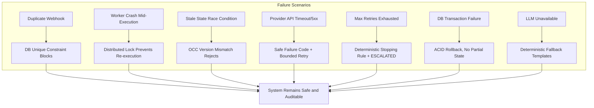

# Failure & Resilience Scenarios

This document describes the failure scenarios the AI Revenue Recovery system handles, and how it safely recovers from each one. All scenarios are verified by deterministic integration tests in `tests/integration/resilience_flow.test.ts`.



*(or in text format below)*

### Resilience Overview (Text View)
1. **Duplicate Webhook** → Database unique constraint deterministically blocks duplicate events.
2. **Worker Crash Mid-Execution** → Distributed lock prevents any second worker from re-executing the same intervention.
3. **Stale State Race Condition** → Optimistic Concurrency Control (OCC) version mismatch instantly rejects the stale update.
4. **Provider API Timeout/5xx** → Failure is safely mapped to a structured code; BullMQ retries are bounded.
5. **Max Retries Exhausted** → Deterministic stopping rule fires; case transitions to `ESCALATED`.
6. **DB Transaction Failure** → Full ACID rollback ensures no partial state corruption.
7. **LLM Unavailable** → Deterministic fallback templates activate instantly; no stalling.

**Result:** The system remains safe and fully auditable across all 7 failure modes.

## 1. Duplicate Event Ingestion

### Scenario
The same payment failure webhook is delivered multiple times (network retry, webhook replay, operator re-submission).

### System Response
1. **Database-Level Unique Constraint**: The persistence layer enforces a unique composite key on `(merchantId, externalEventId, eventType)`. Any duplicate event is deterministically rejected at the database level.
2. **Idempotency Key**: Every ingestion request carries an idempotency key (either from the `Idempotency-Key` header or deterministically generated from `merchantReference + externalEventId`).
3. **No Phantom Cases**: Duplicate events never create redundant revenue cases or trigger duplicate recovery workflows.

### Evidence
- Test: `tests/integration/recovery_flow.test.ts` — duplicate ingestion returns conflict, no new case created
- Schema: `libs/persistence/prisma/schema.prisma` — `@@unique([merchantId, externalEventId, eventType])`

## 2. Concurrent Execution (Worker Crash / Restart)

### Scenario
A worker picks up an intervention, acquires the execution lock, then crashes before marking the result. A second worker attempts to pick up the same intervention.

### System Response
1. **Distributed Lock**: Before execution, the worker claims a database-level lock (`lockedBy`, `lockedAt` fields) on the intervention record.
2. **Lock Rejection**: A second worker attempting to claim the same lock is deterministically rejected — `claimExecutionLock()` returns `false`.
3. **At-Most-Once Enforcement**: The external payment gateway or messaging endpoint is never hit twice for the same logical intervention attempt.

### Evidence
- Test: `tests/integration/resilience_flow.test.ts` — "Worker Failure/Restart: Idempotent execution lock prevents double execution"
- Code: `libs/persistence/src/repositories/execution.repository.ts`

## 3. Stale State / Optimistic Concurrency

### Scenario
Two concurrent processes attempt to transition the same revenue case from `DETECTED` to `ACTIVE_RECOVERY`. One will have a stale version.

### System Response
1. **Version Matching**: Workflow state transitions enforce strict version matching (`version: N → version: N+1`).
2. **Stale Rejection**: The second process receives a concurrency conflict error and does not proceed.
3. **No Partial Updates**: The case state remains consistent — no split-brain scenario.

### Evidence
- Code: `libs/domain/src/state-machine.ts` — version field enforcement
- Schema: `libs/persistence/prisma/schema.prisma` — `version Int @default(0)` on `RevenueCase`

## 4. External Adapter Failure (Razorpay / Twilio / Resend)

### Scenario
An external provider API times out, returns a transient 5xx error, or receives an unsupported action type.

### System Response
1. **Bounded Execution**: The worker invokes the adapter with a timeout and retry wrapper.
2. **Safe Failure Mapping**: If the adapter fails, the failure is caught and mapped to a structured code (e.g., `TIMEOUT`, `CONFIGURATION_ERROR`).
3. **No Double Execution**: The result is recorded atomically. The intervention cannot be re-executed.
4. **Escalation Path**: The failure increments the attempt count. Once `maxAttemptsPerCase` is exhausted, the workflow halts and marks the case as `ESCALATED`.

### Evidence
- Test: `tests/integration/resilience_flow.test.ts` — "External Adapter Failure (Razorpay Timeout): Safely handles failure and maps code"
- Code: `apps/worker/src/providers/razorpay/razorpay.adapter.ts`

## 5. Workflow Exhaustion (Stopping Rules)

### Scenario
An external system continues to fail, or a customer repeatedly fails retries. The maximum allowed retries are exhausted.

### System Response
1. **Deterministic Stopping Rules**: The execution engine detects that `attemptCount >= maxAttemptsPerCase`.
2. **Audit & Escalation**: The system adds an `ESCALATION_TRIGGERED` audit log entry and halts further automation.
3. **Terminal State**: The case transitions to `ESCALATED`, ensuring no runaway looping.

### Evidence
- Test: `tests/integration/resilience_flow.test.ts` — "Queue Retry Exhaustion: System marks case as escalated/terminal"
- Code: `libs/domain/src/state-machine.ts` — `escalate()` transition

## 6. Database Transaction Failure

### Scenario
The system attempts to record an intervention result and transition the case state, but the underlying database transaction fails (e.g., foreign key violation, temporary disconnect).

### System Response
1. **Transaction Rollback**: The persistence layer wraps these operations in strict ACID transactions via Prisma.
2. **No Partial State**: A failure results in a complete rollback. The intervention is not recorded as successful, and the case state remains unchanged.
3. **Safe Retry**: The intervention can be safely retried or escalated by a supervisor process without corrupting business logic.

### Evidence
- Test: `tests/integration/resilience_flow.test.ts` — "Database Persistence Failure: Atomicity via transactions"
- Code: `libs/persistence/src/repositories/execution.repository.ts` — `persistExecutionResult()`

## 7. LLM Unavailability

### Scenario
The AI reasoning engine becomes unavailable, times out, or returns malformed output that fails validation.

### System Response
1. **Timeout Enforcement**: The `HostedLLMClient` applies a strict timeout on all API calls.
2. **Deterministic Fallback**: If the AI fails, `libs/llm/src/fallbacks/templates.ts` provides static, safe reasoning templates. The system continues processing cases without stalling.
3. **No Safety Impact**: Since AI only provides reasoning and message drafts (never executes financial actions), its unavailability does not affect the safety or correctness of the recovery workflow.

### Evidence
- Code: `libs/llm/src/fallbacks/templates.ts`
- Code: `libs/llm/src/client/llm.client.ts` — timeout configuration

## How to Run the Resilience Tests

```bash
# Requires running PostgreSQL and Redis
pnpm test:integration
```

All tests in `tests/integration/resilience_flow.test.ts` exercise these scenarios against a live database, verifying detection, containment, recovery, and audit evidence.
