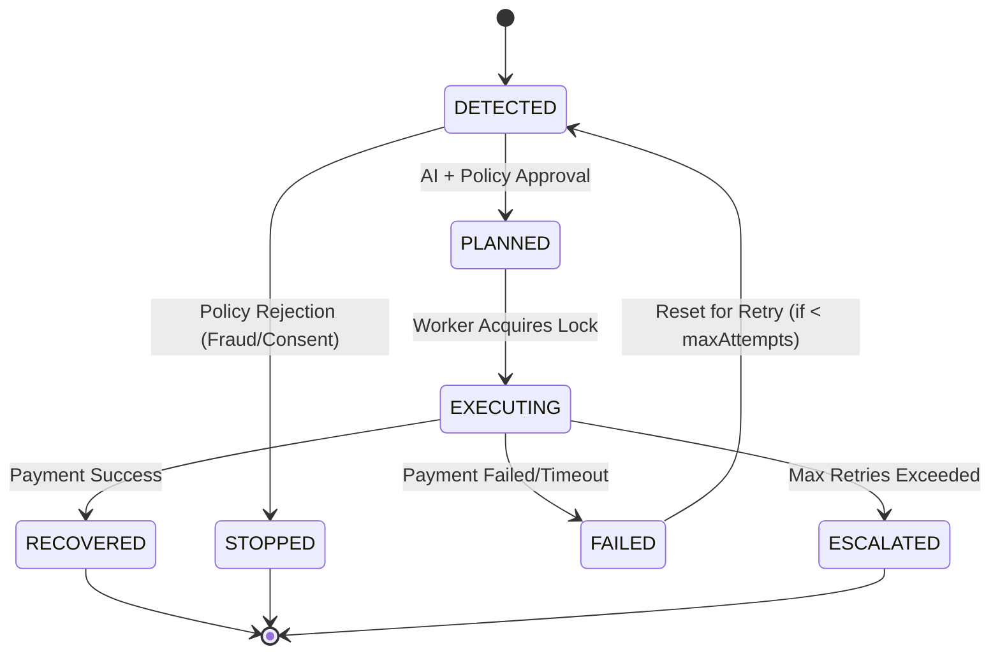

# Feature: Revenue Case Lifecycle

## Problem

When a payment fails (e.g., a subscription mandate bounce, a card expiry, a bank timeout), Razorpay merchants lose revenue silently. Without structured tracking, there is no reliable way to know which failures are recoverable, which have already been attempted, and which have been permanently resolved. Without a lifecycle, the same failure can be retried indefinitely — wasting API quota, triggering fraud flags, and annoying customers.

## Motivation

A typed, state-machine-enforced case entity provides the system's single source of truth for every revenue loss event. Every other module (planning, policy, execution, evaluation) operates against a case and must respect its state. This prevents split-brain scenarios, uncontrolled retries, and orphaned interventions.

## Design

### Case Entity Fields

| Field | Type | Purpose |
|---|---|---|
| `id` | UUID | Globally unique case identifier |
| `merchantId` | string | Owning merchant |
| `externalEventId` | string | Raw event ID from Razorpay webhook |
| `eventType` | enum | `PAYMENT_FAILED`, `MANDATE_FAILED`, etc. |
| `amountMinor` | BigInt | Amount at risk in minor units (paisa) |
| `currency` | string | ISO 4217 currency code |
| `failureCode` | string | Razorpay decline code |
| `status` | enum | Current lifecycle state |
| `version` | int | Optimistic concurrency counter |
| `attemptCount` | int | Total intervention attempts made |
| `createdAt` / `updatedAt` | timestamp | Audit timestamps |

### Lifecycle States



*(or in text format below)*

### Lifecycle States (Text View)
- **DETECTED**: Webhook received, idempotency check passed, case created.
  - Transitions to **PLANNED** if AI + policy engine approved an intervention plan.
  - Transitions to **STOPPED** if Policy engine rejected further intervention (e.g., fraud flag, consent missing).
- **PLANNED**: Waiting for execution.
  - Transitions to **EXECUTING** when BullMQ worker has claimed the job and is contacting the provider.
- **EXECUTING**: Provider API is called.
  - Transitions to **RECOVERED** if Provider confirmed success; revenue is recovered.
  - Transitions to **FAILED** if Provider returned a definitive failure; case may retry if `attemptCount < max`.
  - Transitions to **ESCALATED** if `maxAttemptsPerCase` exhausted; human review required.
- **FAILED**: Resets back to **DETECTED** for a new AI retry strategy.
- **Terminal States**: RECOVERED, STOPPED, ESCALATED.

## Data Flow

```mermaid
flowchart TD
    Webhook[Webhook Arrival] --> Ingestion[Ingestion Controller HTTP POST /events]
    Ingestion --> Idempotency[Idempotency Guard unique constraint check]
    Idempotency --> CaseRep[Case Repository CREATE new RevenueCase]
    CaseRep --> StateMac[State Machine INITIAL to DETECTED]
    StateMac --> AIPlan[AI Planning Service async]
    AIPlan --> Policy[Policy Engine sync gate]
    Policy --> Queue[BullMQ Queue dispatch if approved]
    Queue --> Worker[Worker Execution async]
    Worker --> Outcome[Outcome persistence RECOVERED | FAILED | ESCALATED]
```

*(or in text format below)*

### Data Flow (Text View)
1. **Webhook Arrival** enters the system.
2. Handled by the **Ingestion Controller** (`HTTP POST /events`).
3. Checked by the **Idempotency Guard** (unique constraint check).
4. Persisted by the **Case Repository** (`CREATE` new `RevenueCase`).
5. **State Machine** transitions from `INITIAL` to `DETECTED`.
6. Dispatched to the **AI Planning Service** (async).
7. Validated by the **Policy Engine** (sync gate).
8. Sent to the **BullMQ Queue** (if approved).
9. Picked up by the **Worker Execution** engine (async).
10. Final **Outcome persistence** applied (`RECOVERED` | `FAILED` | `ESCALATED`).

## AI Involvement

AI is involved **exclusively in the PLANNED transition**:
- The LLM diagnoses the failure root cause and drafts customer communication.
- The ML model provides causal propensity scores (CATE) that inform intervention selection.
- AI output is validated by Zod schema before it can influence any state transition.
- If AI fails, deterministic fallback templates are used — the case still progresses.

## Safety Constraints

- **Optimistic Concurrency Control**: Every state transition increments `version`. A stale update (wrong version) is rejected with a `ConflictError`. This prevents race conditions between the planning service and the worker.
- **Terminal State Guard**: Cases in `RECOVERED`, `STOPPED`, or `ESCALATED` states cannot be transitioned further. Any attempt is silently rejected.
- **Maximum Attempt Enforcement**: The policy engine checks `attemptCount >= maxAttemptsPerCase` before approving any new intervention. If exhausted, the case is escalated.

## Failure Cases

| Failure | System Response |
|---|---|
| Duplicate webhook for same case | Idempotency constraint blocks creation; existing case returned |
| Worker crash mid-execution | Distributed lock prevents second worker from double-executing |
| Database transaction failure | Prisma transaction rollback; case state unchanged |
| AI returns invalid schema | Zod validation fails; fallback template used; planning continues |
| State transition with stale version | `ConflictError` thrown; caller must refresh and retry |

## Code References

- `libs/domain/src/state-machine.ts` — Transition logic and version enforcement
- `libs/persistence/src/repositories/` — Case CRUD with Prisma
- `apps/api/src/modules/cases/cases.service.ts` — HTTP-facing case management
- `tests/integration/recovery_flow.test.ts` — Full golden path verification
