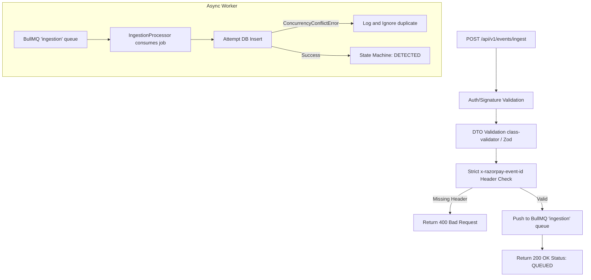

# Feature: Webhook Ingestion & Idempotency

## Problem

Razorpay (and webhook systems in general) deliver events *at least once*. A network failure, a load balancer retry, or an operator re-submission can result in the same payment failure event arriving multiple times. Processing a duplicate event must not create duplicate recovery cases, trigger duplicate interventions, or charge a customer twice.

## Motivation

Idempotency is a first-class financial safety requirement. The ingestion layer is the entry point to the entire system — it must be a strict, deterministic filter that ensures each unique external event creates exactly one revenue case and triggers exactly one recovery workflow, regardless of how many times the event is delivered.

## Design

### Ingestion Flow



*(or in text format below)*

### Ingestion Flow (Text View)
1. Request arrives at `POST /api/v1/events/ingest`.
2. Validated by **Auth Middleware** (HMAC-SHA256 signature).
3. Validated by **DTO Validation** (class-validator / Zod).
4. Enters the **Idempotency Guard**:
   - Strictly requires the `x-razorpay-event-id` header. Rejects with 400 Bad Request if missing.
5. Payload is pushed to the **BullMQ 'ingestion' queue**, using the `x-razorpay-event-id` as the `jobId` for immediate queue-level deduplication.
6. The controller responds immediately with `200 OK` (Status: QUEUED), guaranteeing we meet Razorpay's strict 5-second timeout requirement.
7. Asynchronously, the **IngestionProcessor** worker consumes the job.
8. The worker attempts DB insertion. If a `ConcurrencyConflictError` occurs, the duplicate is safely ignored.
9. If successful, the case transitions to `DETECTED` and orchestration begins.

### Idempotency Implementation

Idempotency is rigorously enforced at two decoupled layers:

1. **Queue Level (BullMQ)**: The `x-razorpay-event-id` is used as the `jobId`. BullMQ inherently prevents enqueuing duplicate jobs with the same ID, shedding duplicate webhooks before they even reach the database layer.
2. **Database Level (Prisma)**: Uniqueness enforcement is applied unconditionally at the database level:
```sql
-- Prisma schema
@@unique([merchantId, externalEventId, eventType])
```
Even in race conditions where queue deduplication is bypassed, the database guarantees that only one case is created. The other receives a unique constraint violation (`ConcurrencyConflictError`), which the worker catches and ignores.

### Supported Event Types

| Event Type | Trigger | Description |
|---|---|---|
| `PAYMENT_FAILED` | Card/UPI payment failure | Direct payment failures |
| `MANDATE_FAILED` | eNACH/nach mandate bounce | Subscription-style auto-debit failures |
| `SUBSCRIPTION_CHARGED_FAILED` | Razorpay Subscriptions failure | Managed subscription billing failures |

### Payload Validation

Every incoming webhook payload is validated against a strict typed DTO before reaching the idempotency guard:
- Unknown fields are rejected
- Required fields (`merchantId`, `externalEventId`, `eventType`, `amountMinor`) are enforced
- Invalid `amountMinor` types (e.g., floats) are rejected — only integers accepted

## AI Involvement

**None.** The ingestion and idempotency layer is fully deterministic. No AI call is made during ingestion. Planning (which involves AI) is dispatched asynchronously *after* the case is safely persisted.

## Safety Constraints

- **Database-Level Uniqueness**: The `@@unique` constraint is the authoritative idempotency mechanism. Application-level caches are supplementary.
- **Secure Webhook Verification**: Cryptographically validates `x-razorpay-signature` using HMAC-SHA256 against raw buffers (via NestJS `rawBody`) and `crypto.timingSafeEqual()` to prevent timing side-channel attacks.
- **Atomic Case Creation**: Case creation and the initial state machine transition are wrapped in a single Prisma transaction. Partial state is impossible.
- **Auth Token Enforcement**: The `POST /api/events` endpoint requires a valid `API_AUTH_TOKEN` header. Unauthenticated requests are rejected with HTTP 401 before any processing begins.
- **No Silent Drops**: Validation failures return HTTP 422 with structured error codes. Operators can inspect why a webhook was rejected.

## Failure Cases

| Failure | System Response |
|---|---|
| Duplicate event (same `externalEventId`) | DB unique constraint fires; HTTP 200 returned with existing case ID |
| Malformed payload | DTO validation fails; HTTP 422 with field-level error details |
| Missing auth token | HTTP 401; event not processed |
| DB unavailable during ingestion | HTTP 503; webhook should be retried by Razorpay |
| Unknown event type | DTO validation fails; HTTP 422 |

## Code References

- `apps/api/src/modules/events/` — HTTP event ingestion controller
- `libs/domain/src/idempotency.ts` — Idempotency key computation
- `libs/persistence/prisma/schema.prisma` — `@@unique` constraint on `RevenueCase`
- `tests/integration/api_ingestion.test.ts` — Duplicate event blocking verification
- `tests/integration/recovery_flow.test.ts` — Full ingestion → planning flow
