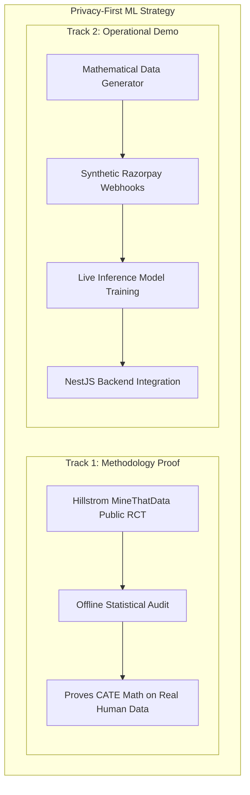

# Feature: Causal ML Pipeline (XGBoost T-Learner)

## Problem

Selecting the right recovery intervention is a causal inference problem, not a classification problem. The question is not "will this customer pay?" but "will this customer pay *because* we sent this specific intervention?" These are different questions. A customer might pay anyway (control group) regardless of whether we intervene — in which case the intervention wastes cost. A naive model that predicts P(pay) cannot answer this; it mixes treatment effects with selection bias.

## Motivation

The Causal ML pipeline implements the **Multi-Treatment T-Learner** — a metalearner that estimates the Conditional Average Treatment Effect (CATE) for each intervention type. This gives the planning layer a net expected incremental value per treatment arm, enabling intervention selection that maximises *incremental* recovery revenue above the baseline of doing nothing.

## Design

### T-Learner Architecture

The T-Learner trains a separate model for each treatment arm:

| Model | Treatment | Predicts |
|---|---|---|
| `μ̂_0(x)` | Control (no action) | P(recovery | no intervention, features x) |
| `μ̂_1(x)` | T1 (Retry Payment) | P(recovery | retry intervention, features x) |
| `μ̂_2(x)` | T2 (Payment Link) | P(recovery | payment link intervention, features x) |

CATE for each treatment: `τ̂_t(x) = μ̂_t(x) − μ̂_0(x)`

Net Expected Incremental Value: `NEIV_t = τ̂_t(x) × amountMinor − cost_t`

The planning layer selects `argmax_t(NEIV_t)` subject to:
- Fraud override: `FRAUD_SUSPECTED` → forced escalation regardless of NEIV
- Negative NEIV: If all interventions have negative NEIV, the case is stopped (do nothing is optimal)

### The Dual-Track ML Strategy

**Why this approach? (The Privacy-First Principle)** 
In a Buildathon environment, we absolutely cannot use real Razorpay merchant data or customer PII, as it violates strict confidentiality and regulatory compliance. However, we also refuse to fabricate the "math" behind our Causal Inference model, and we refuse to mislead the jury by pretending a public dataset is Razorpay data.

To ensure both mathematical rigor and operational integrity, we architected a **Dual-Track ML Strategy**:



*(or in text format below)*

### The Dual-Track ML Strategy (Text View)
1. **Track 1: Methodology Proof**
   - **Input:** Hillstrom MineThatData Public RCT dataset.
   - **Process:** We run an offline statistical audit (`statistical_audit.py`).
   - **Output:** Proves to the data science jury that our XGBoost T-Learner mathematically works on *real human data*.
2. **Track 2: Operational Demo**
   - **Input:** Mathematical Data Generator creates purely Synthetic Razorpay Webhooks.
   - **Process:** The live inference model trains exclusively on synthetic data.
   - **Output:** Proves the NestJS backend integration is structurally sound, requiring zero architectural changes for a live deployment while guaranteeing zero PII leakage.

### Pipeline Files

| File | Purpose |
|---|---|
| `apps/ml-pipeline/src/preprocess.py` | Feature engineering, one-hot encoding, train/val/test split |
| `apps/ml-pipeline/src/train.py` | T-Learner training, model pickling |
| `apps/ml-pipeline/src/predict.py` | Inference logic, NEIV computation |
| `apps/ml-pipeline/src/server.py` | FastAPI inference server (port 8000) |
| `apps/ml-pipeline/src/evaluate_policy.py` | Offline policy validation and intervention scoring |
| `apps/ml-pipeline/src/statistical_audit.py` | Bootstrap CIs, AUROC, PR-AUC, Brier score audit |
| `artifacts/t_learner.pkl` | Trained model artifact |

### Inference API

The FastAPI server exposes:

```
POST /predict
Content-Type: application/json

{
  "daysSinceLastPayment": 10,
  "amountMinor": 150000,
  "isCardError": 1,
  "isHighValueMerchant": 0,
  "isFirstAttempt": 1,
  "amountSegment": "Low",
  "customerLocation": "Urban",
  "paymentChannel": "Web"
}

→ {
    "control_prob": 0.12,
    "t1_prob": 0.31,
    "t2_prob": 0.18,
    "cate_t1": 0.19,
    "cate_t2": 0.06,
    "recommended_treatment": "T1"
  }
```

### Integration with NestJS Domain

`libs/domain/src/ml/propensity.ts` calls the FastAPI server asynchronously during planning:
1. Constructs the feature vector from case fields (amountMinor → history proxy, merchantId → segment proxy)
2. `fetch('http://localhost:8000/predict', { signal: AbortSignal.timeout(3000) })`
3. On success: NEIV scores inform intervention type selection
4. On failure / timeout: deterministic heuristic (`failureCode → treatment`) is used as fallback

## AI Involvement

This module *is* an AI system. The distinction from the LLM layer:
- **LLM**: Generative, language-based, used for diagnosis text and communication drafting
- **ML Pipeline**: Discriminative, numeric, used for causal effect estimation and intervention selection

Both are bounded by the policy engine and cannot independently execute financial actions.

## Safety Constraints

- **Fraud Override**: The ML NEIV score is completely ignored for cases with `failureCode = fraud_suspected`. The policy engine enforces escalation regardless of what the model predicts.
- **Fallback**: If the ML server is unreachable, the domain layer falls back to a deterministic rule (`bank_timeout → retry`, `card_expired → payment_link`, etc.). The system never stalls waiting for the ML server.
- **No PII in Training Data**: The Hillstrom dataset contains no personally identifiable information. The inference API receives anonymised feature vectors only.
- **Test-Mode Isolation**: In the evaluation harness, the ML server's benchmark mode returns deterministic scores based on scenario type — no non-determinism in testing.

## Evaluation Results (Offline Statistical Audit)

Run `python apps/ml-pipeline/src/statistical_audit.py` to generate the full audit report including:
- AUROC per treatment arm
- Precision-Recall AUC
- Brier score (calibration)
- Bootstrap 95% confidence intervals on CATE estimates
- Policy validation: expected recovery lift vs. random and naive-retry baselines

## Code References

- `apps/ml-pipeline/src/` — Full Python ML pipeline
- `libs/domain/src/ml/propensity.ts` — TypeScript integration + fallback
- `artifacts/t_learner.pkl` — Pickled trained model
- `data/processed/hillstrom/` — Preprocessed dataset files
