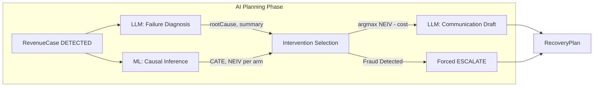

# Feature: AI + ML Recovery Planning

## Problem

Given a failed payment case, what is the optimal recovery action? A naive answer ("always retry") ignores failure context — a card declined for fraud should never be retried. A smarter answer requires two things: (1) understanding the failure reason and drafting a contextually appropriate intervention, and (2) estimating which intervention type maximises the *incremental* probability of recovery given that specific customer's profile.

## Motivation

The Planning Service combines two AI systems — a Large Language Model for failure diagnosis and communication drafting, and a Causal Machine Learning model for uplift-based intervention selection — into a single bounded planning step. Neither system can execute financial actions. Their output is a structured *plan* that the Policy Engine must approve before anything happens.

## Design

### Planning Pipeline

*(or in text format below)*

### Planning Pipeline (Text View)
1. **Input:** `RevenueCase` in `DETECTED` state.
2. **Parallel AI Branches:**
   - **LLM Failure Diagnosis:** Takes `failureCode`, `merchantName`, `amount`, `locale` and outputs `rootCause`, `humanReadableSummary`.
   - **ML Causal Inference:** Takes customer features and outputs CATE (Propensity) and Net Expected Incremental Value (NEIV) per treatment arm.
3. **Intervention Selection:**
   - Evaluates `argmax(NEIV)` subject to cost constraints.
   - If fraud codes are detected, it forces an `ESCALATE` regardless of ML scores.
4. **Communication Draft:** 
   - If the selected channel is SMS/Email, the LLM drafts a recovery message based on the root cause and locale constraints.
5. **Output:** A structured `RecoveryPlan` containing the `interventionType`, `messageDraft`, `diagnosis`, and `mlScores`.

### ML Model: Multi-Treatment T-Learner

- **Architecture**: Three independent XGBoost classifiers — one per arm (Control, Retry, Payment Link).
- **CATE Estimation**: `τ̂_t(x) = μ̂_t(x) − μ̂_0(x)` — the incremental conversion probability above baseline.
- **Net EIV**: `NEIV_t = τ̂_t(x) * amountMinor − cost_t` — the expected incremental revenue minus intervention cost.
- **Dataset**: Hillstrom MineThatData public RCT — a clean experimental dataset used to validate causal methodology without fabricating treatment effects.
- **Inference**: Python FastAPI service at `http://localhost:8000`. Called asynchronously via `fetch()` during planning.
- **Fallback**: If the ML service is unreachable, the domain layer uses a deterministic heuristic based on `failureCode` alone.

### LLM: Structured Generation

- **Provider**: Google Gemini (`gemini-2.5-flash`) via `HostedLLMClient`.
- **Output Enforcement**: Zod schema validation on every LLM response. Malformed responses trigger the deterministic fallback template.
- **Safety Prompting**: Every prompt includes `SharedSafetyPolicyV1` — a system-level instruction forbidding the LLM from claiming specific recovery amounts, providing strict assurances, or generating content that could constitute financial advice.
- **Locale Support**: Prompts specify `locale` (e.g., `EN_IN`, `HI_IN`). For `HI_IN`, the model is instructed to produce Hinglish (Hindi-English mixed) communication.

## AI Involvement

This is the only module where AI participates in decision-making. The involvement is strictly bounded:
- LLM output = text only (diagnosis summary, message draft). Cannot modify case state.
- ML output = numeric scores only. Cannot trigger execution.
- Both outputs are gated by the Policy Engine before any intervention is created.

## Safety Constraints

- **Fraud Code Override**: Cases with `failureCode = fraud_suspected` bypass ML scoring and are directly routed to `ESCALATE_TO_HUMAN`. The ML model's NEIV is ignored for fraud cases.
- **Structured Output Validation**: LLM output is parsed through Zod. Any validation failure activates the fallback template; planning does not stall.
- **No Autonomous Execution**: The `RecoveryPlan` produced by this service is a recommendation only. The Policy Engine decides whether to act on it.
- **Timeout Enforcement**: Both the LLM client and the ML FastAPI call have strict timeouts. Timeouts are safe — they trigger fallback behaviour, not exceptions.

## Failure Cases

| Failure | System Response |
|---|---|
| LLM API down | `getFallbackDecisionExplanation()` + `getFallbackMessageDraft()` used |
| LLM returns malformed JSON | Zod parse failure → fallback template |
| ML service unreachable | Deterministic heuristic fallback (failureCode → treatment mapping) |
| Both LLM and ML unavailable | Fully deterministic plan using rule-based heuristics; case progresses safely |
| Planning takes > timeout | Timeout error caught; case marked for retry or escalation |

## Code References

- `apps/api/src/modules/planning/planning.service.ts` — Orchestrates the full pipeline
- `libs/domain/src/planning.ts` — Intervention selection and NEIV logic
- `libs/domain/src/diagnosis.ts` — Failure code → root cause mapping
- `libs/domain/src/ml/propensity.ts` — ML inference call + fallback
- `libs/llm/src/client/llm.client.ts` — LLM abstraction with timeout
- `libs/llm/src/prompts/` — Prompt templates
- `libs/llm/src/fallbacks/templates.ts` — Deterministic fallback content
- `apps/ml-pipeline/src/server.py` — FastAPI inference server
- `apps/ml-pipeline/src/train.py` — T-Learner training
- `tests/integration/recovery_golden_path.test.ts` — Full planning flow test
