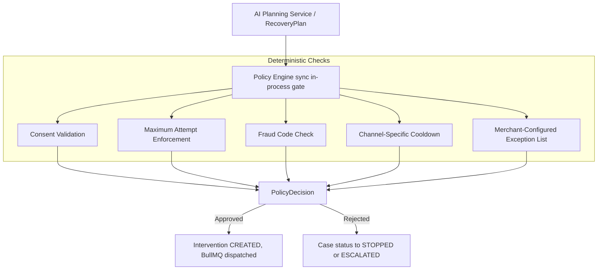

# Feature: Deterministic Policy Engine

## Problem

AI models and ML scores can produce incorrect, unsafe, or contextually inappropriate recommendations. In a financial system, acting on a bad AI recommendation can mean: sending an SMS to a customer who opted out, retrying a payment that the bank has flagged as fraudulent, or retrying a case that has already been attempted the maximum allowed number of times. These are not just bad UX — they are compliance violations.

## Motivation

The Policy Engine is the system's primary safety gate. It sits between the AI Planning output and the intervention execution layer. It enforces deterministic, configurable rules that AI cannot override. This is the architectural embodiment of "bounded AI" — AI assists reasoning, deterministic logic controls financial actions.

## Design

### Policy Engine Location

*(or in text format below)*

### Policy Engine Location (Text View)
1. The **AI Planning Service** submits a proposed `RecoveryPlan`.
2. Evaluated by the **Policy Engine** (sync, in-process gate) which runs strict deterministic checks:
   - **Consent Validation:** Ensures user opted in.
   - **Maximum Attempt Enforcement:** Blocks if retries exceeded.
   - **Fraud Code Check:** Hard blocks any fraud-related cases.
   - **Channel-Specific Cooldown:** Enforces time delays between actions.
   - **Merchant-Configured Exception List:** Respects merchant-level overrides.
3. Yields a **PolicyDecision** (`{ approved: boolean, reasonCodes: string[] }`).
4. **If approved:** An Intervention is `CREATED` and dispatched to BullMQ.
5. **If rejected:** Case status becomes `STOPPED` (or `ESCALATED` if max attempts reached).

### Policy Rules

| Rule | Check | Outcome on Failure |
|---|---|---|
| **Consent Gate** | Customer must have `smsConsent=true` for SMS; `emailConsent=true` for email | Block with `CONSENT_MISSING` |
| **Max Attempt Gate** | `case.attemptCount >= merchantPolicy.maxAttemptsPerCase` | Block with `MAX_ATTEMPTS_REACHED`; escalate |
| **TRAI Calling Window & Frequency** | Must be within 09:00 - 19:59 IST and daily max attempts must not be exceeded | Block with `ATTEMPT_LIMIT_REACHED`; sets `RETRY_AFTER` |
| **Mandatory Fraud Hard-Block** | `rootCause === RootCause.FRAUD` | Hard-block with `FRAUD_DETECTED`; `stopCase: true` |
| **Currency Ledger Support** | `case.amountAtRisk.currency` must be in `merchantPolicy.supportedCurrencies` | Block with `UNSUPPORTED_CURRENCY`; `stopCase: true` |
| **Cross-Border Restriction** | If currency is non-domestic, `merchantPolicy.allowCrossBorderRecovery` must be `true` | Block with `CROSS_BORDER_RESTRICTED`; `stopCase: true` |
| **Cooldown Gate** | `lastAttemptAt + cooldownPeriodMs > now` | Block with `COOLDOWN_ACTIVE` |
| **Terminal State Gate** | `case.status in TERMINAL_STATES` | Block; no-op (case already resolved) |
| **Channel Availability Gate** | Provider must be configured | Block with `CHANNEL_UNAVAILABLE` |

### Merchant-Configurable Parameters

Merchants can configure per-merchant policies (stored in the `MerchantPolicy` table):
- `maxAttemptsPerCase`: Maximum recovery attempts before escalation (default: 3)
- `cooldownPeriodMs`: Minimum time between intervention attempts (default: 24 hours)
- `allowedChannels`: Which intervention types are permitted for this merchant
- `smsConsentRequired` / `emailConsentRequired`: Per-merchant consent configuration
- `supportedCurrencies`: Array of supported ISO currencies (e.g., `["INR", "USD"]`)
- `allowCrossBorderRecovery`: Boolean flag for attempting international recoveries

## AI Involvement

**None.** The policy engine is entirely deterministic. It reads from the database and configuration; it does not call any AI or ML service. It is designed to be a trust boundary — AI cannot influence the outcome of a policy check.

## Safety Constraints

- **In-Process Execution**: The policy check runs synchronously within the API process, not as a separate service. This prevents network partitions from bypassing the gate.
- **Immutable Audit Trail**: Every policy decision (approved or rejected) is appended to the case's `AuditLog` with the full set of reason codes. This makes all gate decisions inspectable.
- **Default Deny**: If the merchant policy record does not exist, the engine defaults to `maxAttempts=1`, `cooldown=24h`, and `no-channels` — i.e., it escalates rather than permitting anything.
- **Reason Code Transparency**: Rejected plans carry an array of `reasonCodes` that are surfaced to the operations dashboard, making it clear why the AI's plan was blocked.

## Failure Cases

| Failure | System Response |
|---|---|
| Policy record missing for merchant | Default-deny policy applied; case escalated |
| DB unavailable during policy check | Exception propagates; planning service marks failure; case not advanced |
| Policy rule throws runtime exception | Caught; treated as deny decision with `POLICY_ERROR` reason code |
| AI plan includes an unknown intervention type | Schema validation catches it before reaching policy engine |

## Code References

- `libs/domain/src/policy.ts` — Core rule evaluation logic
- `libs/domain/src/qualification.ts` — Case qualification (fraud code triage)
- `apps/api/src/modules/policies/policies.service.ts` — Policy fetch and application
- `libs/persistence/prisma/schema.prisma` — `MerchantPolicy` model
- `tests/integration/ai_safety_bounds.test.ts` — AI cannot override policy gates
- `tests/integration/recovery_golden_path.test.ts` — Policy gate in the full workflow
