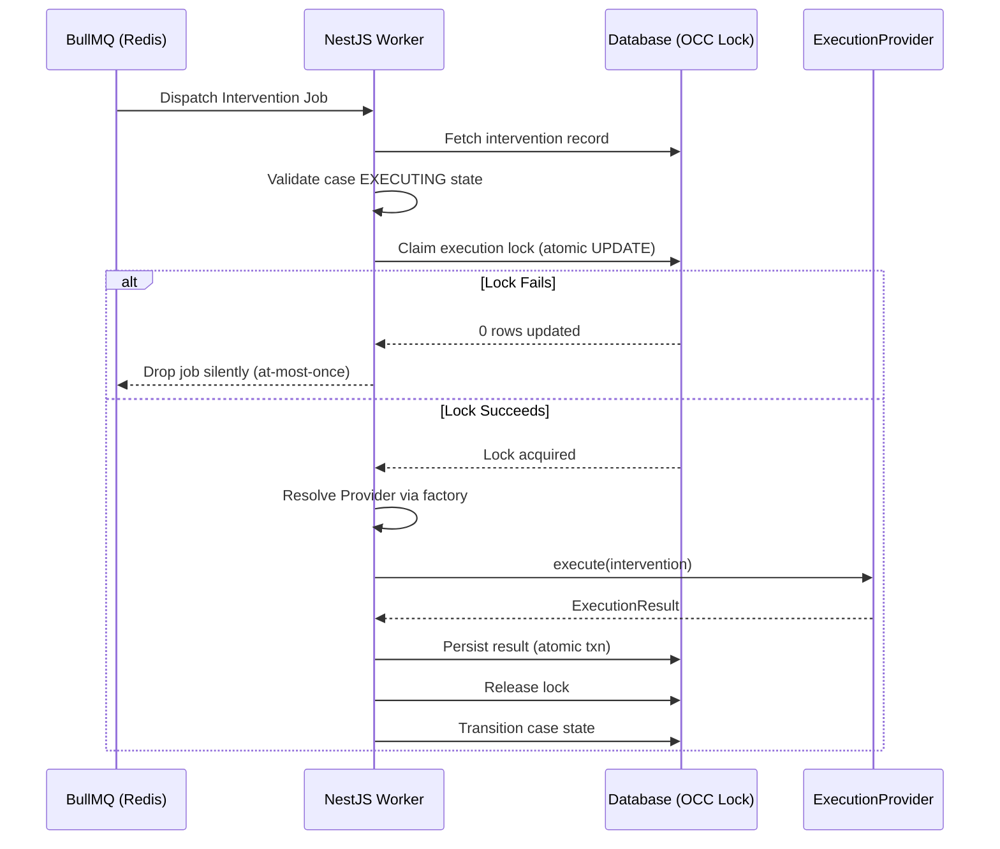

# Feature: Execution Worker & Provider Adapters

## Problem

Once a recovery plan is approved by the policy engine, it must be executed against an external provider (Razorpay API, Twilio, Resend). This execution is inherently asynchronous — the API calls may take seconds, may fail transiently, and may need to be retried. The system must enforce that each approved intervention is executed **exactly once** regardless of network conditions, worker crashes, or queue re-deliveries.

## Motivation

The execution layer decouples the decision (what to do) from the action (doing it). Using BullMQ as a durable job queue, execution becomes retryable at the infrastructure level while remaining idempotent at the application level via the distributed locking mechanism. The `ExecutionProvider` interface abstraction allows swapping providers (Razorpay → production sandbox → live) without changing orchestration logic.

## Design

### Worker Architecture



*(or in text format below)*

### Worker Architecture (Text View)
1. **BullMQ Queue** dispatches the intervention job.
2. **InterventionProcessor** (in NestJS Worker) picks up the job.
3. **Fetch & Validate:** Fetches intervention record from DB and validates the case is in the `EXECUTING` state.
4. **Claim Execution Lock:** Performs an atomic DB update.
   - *If lock fails:* Drops the job silently to guarantee at-most-once execution.
   - *If lock succeeds:* Proceeds to execution.
5. **Execution:** Resolves the `ExecutionProvider` via factory and calls `provider.execute(intervention)`.
6. **Result:** Receives the `ExecutionResult` (`{ success, resultCode, payload }`).
7. **Persist & Release:** Persists the result in an atomic transaction, releases the lock, and transitions the case state (`RECOVERED` or `FAILED`).

### Provider Factory

The `ProviderFactory` resolves the correct provider based on intervention type:

| Intervention Type | Provider | Notes |
|---|---|---|
| `RETRY_PAYMENT` | `RazorpayAdapter` | Calls Razorpay `/v1/payments/{id}/retry` |
| `SEND_PAYMENT_LINK` | `RazorpayAdapter` | Calls Razorpay `/v1/payment_links` |
| `SEND_SMS_REMINDER` | `TwilioAdapter` | Sends via Twilio Messages API |
| `SEND_EMAIL_REMINDER` | `ResendAdapter` | Sends via Resend email API |
| `ESCALATE_TO_HUMAN` | `EscalationAdapter` | Creates audit entry; no external call |

### Razorpay Adapter

- **Test Mode Guard**: Checks `ENABLE_RAZORPAY_TEST_MODE=true`. If not set to `true`, throws `ConfigurationError` before any API call.
- **Timeout Wrapping**: All Razorpay API calls are wrapped with a configurable timeout. Timeout → `TIMEOUT` result code.
- **Response Mapping**: HTTP 200 → `SUCCEEDED`. HTTP 4xx → `PROVIDER_ERROR`. HTTP 5xx / timeout → retryable.
- **Deterministic Mode**: In benchmark/evaluation mode, the adapter returns deterministic outcomes based on the scenario type (not random — fully reproducible).

## AI Involvement

**None.** The execution worker does not call any AI or ML service. It executes the plan that was already validated by the policy engine. The worker's only inputs are the approved intervention record from the database.

## Safety Constraints

- **Distributed Execution Lock**: Before calling any external provider, the worker performs:
  ```sql
  UPDATE Intervention
  SET lockedBy = $workerId, lockedAt = now()
  WHERE id = $id AND lockedBy IS NULL
  ```
  If `lockedBy IS NOT NULL`, the update affects 0 rows → lock not acquired → job silently dropped.
- **Atomic Result Persistence**: The result code and case state transition are wrapped in a single Prisma transaction. If the transaction fails, the lock is still held (preventing retry), and a supervisor process can inspect and release it.
- **Razorpay Test-Mode Enforcement**: A runtime check prevents production Razorpay calls in any environment where `ENABLE_RAZORPAY_TEST_MODE !== 'true'`. This is not a soft warning — it throws and aborts execution.
- **Bounded Retries**: BullMQ job retry configuration limits the number of automatic retries. Once exhausted, the job is moved to a dead-letter queue and the case is escalated.

## Failure Cases

| Failure | System Response |
|---|---|
| Worker crashes after lock acquired | Lock remains held; `StaleLockScannerProcessor` cron automatically detects TTL expiration, releases lock, and restores case to retryable state (no manual intervention). |
| Provider returns 5xx | `PROVIDER_ERROR` recorded; BullMQ may retry (bounded) |
| Provider times out | `TIMEOUT` result; BullMQ may retry (bounded) |
| Razorpay API key invalid | `CONFIGURATION_ERROR`; case escalated; no retry |
| DB unavailable when persisting result | Transaction fails; lock remains; `StaleLockScannerProcessor` eventually recovers it |
| BullMQ max retries exhausted | Dead-letter queue; case → `ESCALATED` |
| Partial Payment Settled | System accurately computes remaining `amountAtRiskMinor` and reverts case to `DETECTED`, triggering AI to dynamically plan for the remaining balance. |

## Code References

- `apps/worker/src/worker.module.ts` — BullMQ consumer registration
- `apps/worker/src/processors/` — InterventionProcessor job handler
- `apps/worker/src/providers/provider.factory.ts` — Provider resolution
- `apps/worker/src/providers/razorpay/razorpay.adapter.ts` — Razorpay execution adapter
- `apps/worker/src/providers/twilio/` — Twilio SMS adapter
- `apps/worker/src/providers/email/` — Resend email adapter
- `libs/persistence/src/repositories/execution.repository.ts` — Lock + result persistence
- `tests/integration/resilience_flow.test.ts` — Lock, crash, timeout scenarios
