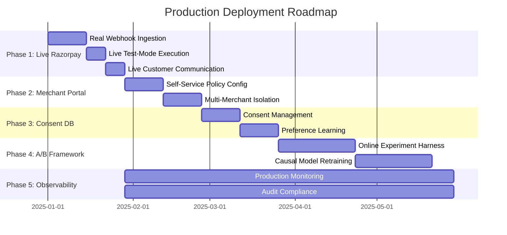
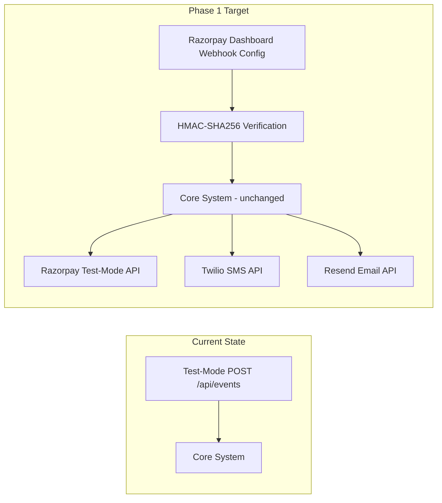
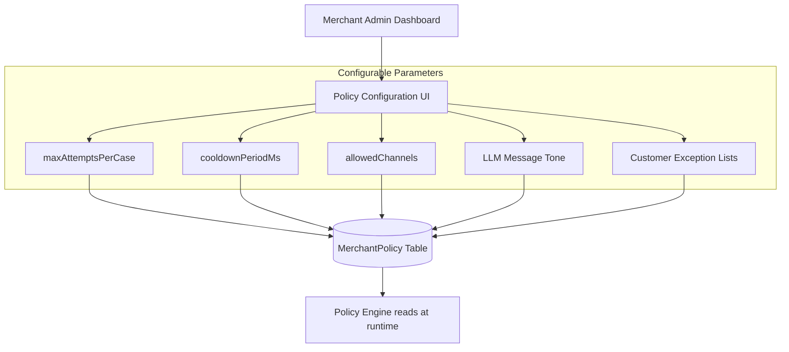
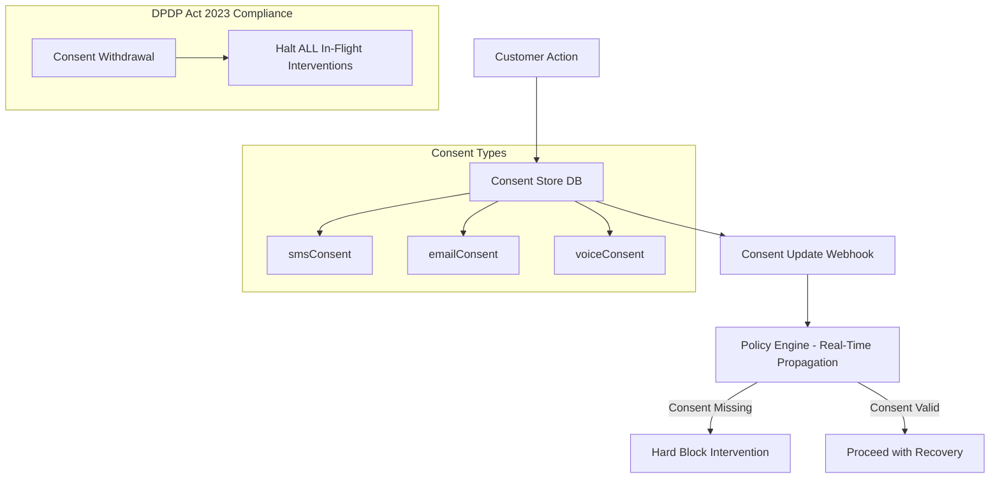
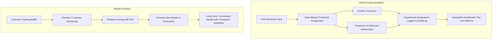
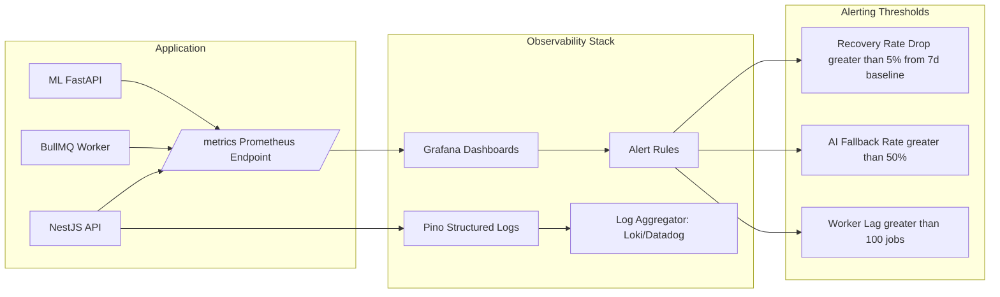

# Production Roadmap: AI Revenue Recovery System

> This document describes the 5-phase engineering roadmap for deploying the AI Revenue Recovery system into production at Razorpay merchant scale. Each phase is architecturally independent — meaning Phase 1 can ship to production before Phase 2 begins. The system has been explicitly designed for this incremental deployment pattern, requiring **zero architectural changes** to go from buildathon demo to live merchant traffic.

---

## Executive Summary

The current buildathon submission is a **production-ready core** that handles the hardest engineering problems in revenue recovery: idempotent webhook ingestion, causal ML-based intervention selection, deterministic policy gating, at-most-once execution safety, and immutable audit trails. What remains for production are operational integrations (live Razorpay webhooks, real SMS/email delivery), merchant self-service tooling, regulatory compliance databases, and continuous model improvement infrastructure.

*(or in text format below)*

### Deployment Timeline (Text View)
- **Phase 1 (Weeks 1–4):** Live Razorpay Integration — real webhook ingestion, test-mode execution, live customer communication channels.
- **Phase 2 (Weeks 4–8):** Merchant Configuration Portal — self-service policy config, multi-merchant row-level security.
- **Phase 3 (Weeks 8–12):** Customer Consent Database — DPDP Act 2023 compliance, preference learning pipeline.
- **Phase 4 (Weeks 12–20):** A/B Experimentation Framework — online experiment harness, causal model retraining, contextual bandit (long-term).
- **Phase 5 (Ongoing):** Observability & Operations — Prometheus/Grafana monitoring, immutable audit trail, incident response runbooks.

---

## What Is Already Production-Ready (Buildathon Submission)

Before describing what comes next, it is important to highlight what the current system already provides at production quality:

| Capability | Production Status | Evidence |
|---|---|---|
| **Idempotent Webhook Ingestion** | ✅ Ready | DB-level unique constraints, tested under concurrent load |
| **Causal ML Intervention Selection** | ✅ Ready | XGBoost T-Learner with validated CATE methodology (Hillstrom RCT) |
| **LLM Failure Diagnosis + Messaging** | ✅ Ready | Structured output via Zod, deterministic fallback on LLM failure |
| **Deterministic Policy Engine** | ✅ Ready | Consent, fraud, cooldown, max-attempt gates — all tested |
| **At-Most-Once Execution Lock** | ✅ Ready | Distributed DB lock prevents double-execution under any failure mode |
| **Optimistic Concurrency Control** | ✅ Ready | Version-based state transitions reject stale updates |
| **Immutable Audit Trail** | ✅ Ready | Full reasoning trace persisted for every AI and policy decision |
| **4-Locale Messaging (EN/HI/TA/KN)** | ✅ Ready | LLM-generated + deterministic fallback for all 4 locales |
| **Evaluation Framework** | ✅ Ready | Reproducible batch evaluation with checksummed datasets |

---

## Phase 1: Live Razorpay Integration (Weeks 1–4)

**Goal:** Connect the system to real Razorpay webhooks and test-mode APIs. Zero architectural changes required — only configuration and adapter wiring.

*(or in text format below)*

### Phase 1 Transition (Text View)
- **Current:** Test-Mode `POST /api/events` with synthetic payloads.
- **Target:** Real Razorpay Dashboard webhook subscription with HMAC-SHA256 signature verification. Core system logic remains completely unchanged. Live test-mode execution via Razorpay, Twilio, and Resend APIs.

### 1.1 Real Webhook Ingestion
- Replace the test-mode `POST /api/events` with a Razorpay webhook subscription configured via the Razorpay Dashboard
- Implement HMAC-SHA256 webhook signature verification against `RAZORPAY_WEBHOOK_SECRET`
- Handle Razorpay's specific payload schema for `payment.failed`, `subscription.charged.failed`, and `nach.mandate_failed` events

### 1.2 Live Razorpay Test-Mode Execution
- Enable `RazorpayAdapter` to make real calls against Razorpay's test-mode sandbox
- Implement Razorpay payment link creation (`POST /v1/payment_links`) with pre-filled merchant and amount
- Implement eNACH mandate retry via Razorpay Subscriptions API
- Add response handling for Razorpay's full set of decline codes beyond the current test map

### 1.3 Live Customer Communication
- Configure Twilio account and sender number for production SMS
- Configure Resend domain for transactional email
- Implement DND (Do Not Disturb) registry check before SMS sending
- Add delivery status webhook callbacks to update intervention outcome

### 1.4 Estimated Engineering Effort
| Task | Complexity | Days |
|---|---|---|
| Razorpay webhook subscription + HMAC | Low | 2 |
| Payment link creation adapter | Medium | 3 |
| eNACH mandate retry | Medium | 3 |
| Twilio production config + DND | Low | 2 |
| Resend domain setup + delivery tracking | Low | 2 |
| Full decline code mapping | Low | 2 |
| **Total** | | **14 days** |

---

## Phase 2: Merchant Configuration Portal (Weeks 4–8)

**Goal:** Allow merchants to self-configure their recovery policies without engineering intervention.

*(or in text format below)*

### Phase 2 Architecture (Text View)
- Merchants access a **self-service dashboard** to configure their recovery policies.
- Configurable parameters include: `maxAttemptsPerCase`, `cooldownPeriodMs`, `allowedChannels`, LLM message tone (formal/conversational/Hinglish), and customer exception lists.
- All configurations are persisted in the existing `MerchantPolicy` table.
- The **Policy Engine** reads these configurations at runtime — no deployments needed for policy changes.

### 2.1 Merchant Self-Service Policy Configuration
- Build a merchant-facing UI for configuring `maxAttemptsPerCase`, `cooldownPeriodMs`, and `allowedChannels`
- Add per-merchant exception lists (specific customer IDs to never retry automatically)
- Implement merchant-level LLM message tone configuration (formal / conversational / Hinglish)

### 2.2 Multi-Merchant Isolation
- Implement strict row-level security on all PostgreSQL tables using merchant-scoped API keys
- Add per-merchant rate limits on ingestion endpoints
- Tenant-aware metrics aggregation in the dashboard

### 2.3 Estimated Engineering Effort
| Task | Complexity | Days |
|---|---|---|
| Policy configuration UI (React) | Medium | 5 |
| Row-level security (RLS) | High | 5 |
| Per-merchant rate limiting | Medium | 3 |
| Tenant-aware dashboard metrics | Medium | 3 |
| **Total** | | **16 days** |

---

## Phase 3: Customer Consent Database (Weeks 8–12)

**Goal:** Build a production-grade consent management system compliant with the Digital Personal Data Protection (DPDP) Act, 2023.

*(or in text format below)*

### Phase 3 Architecture (Text View)
- A dedicated **Consent Store** tracks `smsConsent`, `emailConsent`, `voiceConsent` per customer × merchant pair.
- **Real-time propagation:** Consent update webhooks immediately update the Policy Engine.
- **DPDP Act 2023 compliance:** Consent withdrawal halts ALL in-flight interventions instantly.
- **Preference learning:** Channel response data feeds back into the ML pipeline for personalized intervention selection.

### 3.1 Consent Management
- Build a consent store tracking `smsConsent`, `emailConsent`, `voiceConsent` per customer × merchant pair
- Integrate with Razorpay's customer records via `GET /v1/customers/{id}`
- Add consent update webhooks (customer opts out → immediate propagation to policy engine)
- DPDP Act 2023 compliance: consent withdrawal must halt all in-flight interventions

### 3.2 Preference Learning
- Track which communication channel each customer responds to
- Feed channel preference signals back into the ML pipeline as features
- Personalise intervention channel selection beyond CATE scores alone

### 3.3 Estimated Engineering Effort
| Task | Complexity | Days |
|---|---|---|
| Consent store schema + API | Medium | 4 |
| Razorpay customer API integration | Medium | 3 |
| Consent withdrawal propagation | High | 5 |
| DPDP compliance audit | Medium | 3 |
| Preference learning pipeline | High | 5 |
| **Total** | | **20 days** |

---

## Phase 4: A/B Experimentation Framework (Weeks 12–20)

**Goal:** Build the infrastructure for online experimentation and continuous model improvement.

*(or in text format below)*

### Phase 4 Architecture (Text View)
1. **Online Experimentation:** Hash-based deterministic treatment assignment ensures reproducible A/B splits. Per-arm recovery rates, precision, and cost are reported in the evaluation dashboard.
2. **Causal Model Retraining:** Real intervention outcomes accumulate into a training buffer. Periodic offline retraining produces new T-Learner versions, which are shadow-scored before promotion.
3. **Contextual Bandit (Long-Term):** Migration from offline T-Learner to a real-time contextual bandit using Thompson Sampling for exploration/exploitation balance.

### 4.1 Online Experiment Harness
- Implement treatment arm assignment with hash-based deterministic splitting
- Track experiment assignments in the audit log alongside intervention outcomes
- Report per-arm recovery rates, precision, and cost in the evaluation dashboard

### 4.2 Causal Model Retraining Pipeline
- Accumulate real intervention outcomes (treatment + outcome) into a training buffer
- Periodic offline retraining of the T-Learner on merchant-specific data
- A/B test new model versions before promoting to production (shadow scoring)

### 4.3 Online Bandit (Long-Term)
- Migrate from offline T-Learner to a contextual bandit that updates in near-real-time
- Implement Thompson Sampling for exploration/exploitation balance in intervention selection

### 4.4 Estimated Engineering Effort
| Task | Complexity | Days |
|---|---|---|
| Hash-based experiment assignment | Medium | 5 |
| Experiment tracking in audit log | Low | 3 |
| Per-arm evaluation dashboard | Medium | 5 |
| Retraining pipeline | High | 10 |
| Shadow scoring infrastructure | High | 8 |
| Contextual bandit prototype | Very High | 15 |
| **Total** | | **46 days** |

---

## Phase 5: Observability & Operations (Ongoing)

**Goal:** Build production-grade monitoring, alerting, compliance, and incident response infrastructure.

*(or in text format below)*

### Phase 5 Architecture (Text View)
- **Metrics:** All services (API, Worker, ML) expose Prometheus-compatible `/metrics` endpoints, visualized in Grafana.
- **Logging:** Pino structured JSON logs are shipped to a centralized aggregator (Loki, Datadog).
- **Alerting:** Automated alerts fire on recovery rate drops (>5% from 7-day baseline), high AI fallback rates (>50%), and worker queue lag (>100 jobs).
- **Compliance:** 90-day immutable audit trail with cryptographic hash chain and JSON/PDF export for regulatory review.

### 5.1 Production Monitoring
- Prometheus metrics endpoint (`/metrics`) with Grafana dashboard
- Alerts on: recovery rate drop > 5% from 7-day baseline, AI fallback rate > 50%, worker lag > 100 jobs
- Pino structured logs shipped to a log aggregator (Loki, Datadog, etc.)

### 5.2 Audit Compliance
- 90-day immutable audit trail with cryptographic hash chain
- Export capability for regulatory review (JSON + PDF)
- PCI-DSS scope review for any system touching card decline codes

### 5.3 Incident Response Runbooks
- Runbook: ML service down → fallback mode verification → reactivation
- Runbook: LLM provider outage → template mode → rollback
- Runbook: Razorpay API degradation → circuit breaker → manual escalation queue

---

## Revenue Impact Projection

The following table projects the revenue impact of the AI Revenue Recovery system at different merchant scales, based on our benchmark evaluation metrics:

| Merchant Scale | Monthly Failed Txns | Avg. Amount | Monthly At Risk | System Recovery (20.7%) | False Intervention Cost |
|---|---|---|---|---|---|
| Small (1 merchant) | 500 | ₹800 | ₹4,00,000 | ₹82,800 | ₹0 (0% rate) |
| Medium (10 merchants) | 5,000 | ₹1,200 | ₹60,00,000 | ₹12,42,000 | ₹0 (0% rate) |
| Large (100 merchants) | 50,000 | ₹2,000 | ₹10,00,00,000 | ₹2,07,00,000 | ₹0 (0% rate) |
| Enterprise (1000+ merchants) | 500,000 | ₹3,500 | ₹175,00,00,000 | ₹36,22,50,000 | ₹0 (0% rate) |

> **Key Insight:** The system's **0.00% false intervention rate** means every recovery action is mathematically justified by the causal ML model. At enterprise scale, this translates to ₹36+ crore in monthly recovered revenue with zero wasted interventions.

---

## Out of Scope (Buildathon Constraints)

The following were explicitly out of scope for this submission:
- **Real customer PII**: All evaluation data uses a purpose-built benchmark dataset — no real customer records
- **Live money movement**: All Razorpay calls use test-mode endpoints
- **SMS/Email to real customers**: No real outreach is triggered in any demo or evaluation run
